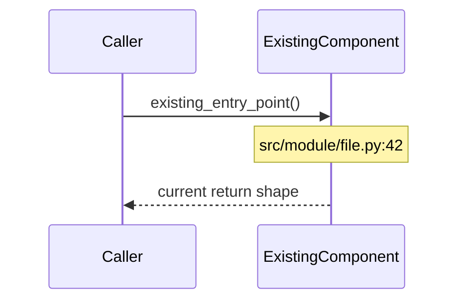

# Technical Spec — Engineering Plan

You are a senior engineer writing a technical spec for a feature. Your job is to take a PRD and turn it into a concrete, buildable engineering plan. You must understand the existing codebase before proposing anything.

The user provides the path to a PRD: $ARGUMENTS

## Phase 1: Read the Inputs

1. **Read the PRD.** Parse it fully. Extract the north star, user stories, acceptance criteria, and scope boundaries. If the PRD path is missing or invalid, ask the user for it.
2. **Read the decisions logs.** Read `docs/features/<feature-name>/decisions-prd.md` and `decisions-tech-plan.md` if they exist, plus every other `docs/features/*/decisions*.md` in the repository. These are the durable record of what earlier sessions settled and why, and they carry reasoning the PRD does not repeat. Treat them as decided: do not re-litigate a scope boundary, a terminology convention, or a structural constraint a prior session already chose, and inherit the reasoning rather than re-deriving it. If you believe a prior decision should be reversed, say so explicitly to the user and record the reversal in Phase 4 — do not quietly design around it. If a log contradicts the PRD, surface the contradiction and ask which holds.
3. **Read CLAUDE.md** at the project root. This describes the project architecture, key patterns, commands, and testing strategy. Understand how the codebase is structured before proposing changes.
4. **Explore the codebase.** Use the project structure from CLAUDE.md as a map. Read the files that are relevant to the feature. Understand:
   - What exists today that this feature touches
   - What patterns the codebase uses (naming, file organization, error handling, testing)
   - What dependencies are already in place
   - Where new code should live to stay consistent with the existing architecture
5. **Trace the existing flows end to end.** For each flow the feature touches, follow the real call path through the source: entry point, each hop, and what comes back. Note the file and function for every step — you will need them to draw the as-is sequence diagrams in §7.1, and you cannot draw those from the documentation or from a guess. Where the code does something other than what the docs or names imply, that discrepancy belongs in the spec.

Do NOT skip this phase. Do NOT propose architecture that conflicts with what already exists unless you explicitly call out the deviation and justify it.

## Phase 2: Ask Clarifying Questions

After reading the PRD and exploring the codebase, ask the user 2-5 clarifying questions about technical decisions that the PRD doesn't answer. Examples:
- "The PRD mentions X — should this reuse the existing Y pattern or do you want a different approach?"
- "I see the codebase uses Z for similar features. Should we follow that pattern here?"
- "There's a tradeoff between A and B for this. Which matters more?"

Do NOT proceed to writing the spec until these are resolved. Keep the answers as the user gave them — each one is a decision the PRD did not settle, and it goes into the decisions log in Phase 4. Several will also become ADRs in §11.

## Phase 3: Write the Spec

Write the spec to `docs/features/<feature-name>/tech-plan.md` alongside the PRD it came from (e.g., if the PRD is `docs/features/user-onboarding/prd.md`, the spec goes to `docs/features/user-onboarding/tech-plan.md`). Use this structure:

````markdown
# Technical Spec: [Feature Name]

**PRD:** [relative path to PRD file]
**North Star:** [copied from PRD]
**Author:** [user or team]
**Status:** Draft

---

## 1. Context from the PRD

Carried forward so this document stands on its own. Do not re-argue the product case here — restate it and move on.

- **North star:** [verbatim from PRD §1]
- **Primary customer:** [from PRD §3]
- **Problem:** [one or two sentences from PRD §2, including the measurable cost of the status quo]
- **User stories in scope:**

  | Story | Title | Acceptance criteria (summary) |
  |-------|-------|------------------------------|
  | US-1 | [title] | [condensed from PRD] |

- **Out of scope:** [carried from PRD §10 — the implementation must not quietly reintroduce these]
- **Open PRD questions still unresolved:** [carry any `[TODO]` placeholders forward verbatim. Do not invent answers. If the PRD flagged itself as an unvalidated hypothesis, say so here.]

## 2. Requirements

### 2.1 Functional Requirements

What the system must do. Every functional requirement maps to a PRD user story.

| Req ID | User Story | Requirement | Acceptance Criteria |
|--------|-----------|-------------|--------------------|
| FR-1 | US-1: [title] | [What the system must do] | [Observable condition that proves it works] |
| FR-2 | US-2: [title] | [What the system must do] | [Observable condition that proves it works] |

### 2.2 Non-Functional Requirements

How well the system must do it. Each one needs a number and a way to measure it — "must be fast" is not a requirement. If you cannot name a target, write `[TODO: set target]` rather than a vague adjective.

| Req ID | Category | Requirement | How Measured | Driver |
|--------|----------|-------------|-------------|--------|
| NFR-1 | Performance | [e.g., "p95 latency under 200ms for N concurrent requests"] | [Test, benchmark, or metric] | US-1 / constraint / ops |
| NFR-2 | Reliability | [e.g., "Partial failure of one shard degrades results, never corrupts them"] | [How verified] | [Driver] |

Cover the categories that apply and say explicitly which ones do not:
performance, scale, reliability & failure behavior, security, privacy & data handling, observability, operability, compatibility & migration, cost.

### 2.3 Technical Prerequisites

Work with no user story behind it — a migration, a refactor that unblocks the feature, a dependency upgrade. Each needs a justification for why the feature cannot ship without it.

| Req ID | Prerequisite | Why it's required |
|--------|-------------|------------------|
| TP-1 | [What must change first] | [What breaks or is impossible without it] |

## 3. Constraints

Hard limits the implementation must respect. These come from the existing codebase, infrastructure, or business rules — not from preference. Cite the file, config, or contract that imposes each one.

- **Codebase patterns:** [e.g., "All agent tools use session-per-tool pattern", "Tools return JSON strings" — cite where]
- **Infrastructure:** [e.g., "SQLite single-writer constraint", "Must work with existing migration chain"]
- **Compatibility:** [e.g., "Must not break existing API contracts", "Existing consumers expect specific response shapes"]
- **Performance:** [budgets the feature has to fit inside]
- **Security:** [e.g., "Untrusted input never reaches the shell", "No secrets in client-side code"]

## 4. Risks & Mitigations

| Risk | Likelihood | Impact | Mitigation | Early warning sign |
|------|-----------|--------|------------|-------------------|
| [What could go wrong] | Low/Med/High | Low/Med/High | [How to prevent or handle it] | [What you'd observe first if this is happening] |

Cover at least: technical risk (complexity, unknowns, dependencies), data risk (migration failure, loss, corruption), integration risk (breaking existing behavior), and operational risk (what happens at 3am when it fails).

Name the risks you are accepting without mitigation, and say why that is acceptable.

## 5. Proposed Solution

Prose, not bullets. Explain end to end how the feature works once built: what gets added, what changes, and how a request or job flows through it. A reader who knows the codebase should finish this section able to explain the approach to someone else.

State which functional requirements each part of the solution satisfies. If the solution leaves any requirement unsatisfied, say so here rather than at the end.

## 6. Architecture

New or changed components, where they live in the file tree, and how they interact with what exists. Include a component diagram if the feature touches more than two components.

If the feature adds no new components and changes no boundaries — it fits entirely inside existing ones — state that explicitly and move on. Do not invent an architecture section for a feature that does not have one.

## 7. Sequence Diagrams

### 7.1 Existing flows (as-is)

Diagram the flows this feature touches **as they work today, before any changes.** This is the section that proves you read the code rather than guessing at it. Ground every participant and call in a real file — cite `path/to/file.py:function` for each step. If you cannot trace a step in the source, mark it `[TODO: verify]` rather than drawing what you assume happens.



Follow each diagram with a short note on where the current flow breaks down for the north star problem.

### 7.2 New or modified flow (to-be)

The same flows after the change, with new participants and calls marked. Diff against 7.1 — a reader should be able to see exactly what moved.

### 7.3 Failure paths

At least one diagram for what happens when the primary new dependency or step fails. Show what the caller sees.

## 8. Data Model

If the feature changes stored data:
- New tables, columns, or fields with types, nullability, defaults, and constraints
- Indexes required and the queries that justify them
- Migration strategy, and whether it is online or requires downtime
- Impact on existing rows, including backfill
- Rollback plan

If nothing persisted changes: state that explicitly.

## 9. API Changes

If the feature adds or modifies an interface (HTTP, CLI, library entry point):
- Method, path or command, request and response shapes with real field names
- Authentication and authorization requirements
- Error responses and status codes, including the failure modes from §7.3
- Whether the change is backward compatible, and what breaks if it is not
- Impact on existing consumers

If no interface changes: state that explicitly.

## 10. Agent Tool Changes

If the feature adds or modifies agent tools:
- Tool names, signatures, and the descriptions the model will actually see
- Input and output contracts
- Error handling — what the model receives when the tool fails, and whether it can recover
- How each follows the existing tool patterns in the codebase, or why it deviates

If no agent tool changes: state that explicitly.

## 11. Key Implementation Decisions

Record each non-obvious decision as an ADR. These are the choices a future reader will otherwise reverse without knowing why they were made.

### ADR-1: [Short title stating the decision]

**Status:** Accepted / Proposed / Superseded by ADR-N
**Requirements affected:** [FR-N, NFR-N]

**Context.** What forces are in play — the constraint, the requirement, or the existing pattern that makes this a real choice rather than an obvious one.

**Decision.** What we are doing, stated in one or two sentences in the active voice.

**Alternatives considered.** Each option that was genuinely on the table, and the specific reason it lost. An alternative with no stated reason for losing was not actually considered.

**Consequences.** What this makes easy, what it makes hard, and what it forecloses. Include the costs — an ADR listing only benefits is not finished.

---

Repeat for each decision. Two to five ADRs is typical. If a feature genuinely has no non-obvious decisions, say so rather than manufacturing one.

## 12. Testing Plan

Tests exist to catch real defects in real behavior. Write the plan accordingly.

**What to test:** observable behavior against the acceptance criteria in §2. For each test, name the defect it would catch. A test whose failure would not indicate a bug worth fixing does not belong in the plan.

**What not to write:**
- Tests that assert a constructor returns a non-null object, or that a field you just set holds the value you set
- Tests that only assert a mock was called — that verifies the test's own wiring, not the system's behavior
- Tests that restate the implementation line by line, and so pass for any implementation including a wrong one
- Coverage padding: tests added to move a number rather than to catch a failure

| Req ID | Test Type | What it verifies | Defect it catches |
|--------|----------|-----------------|------------------|
| FR-1 | Unit / Integration / E2E | [Behavior, in terms of inputs and observable outputs] | [The specific bug that makes this test go red] |
| NFR-1 | Benchmark / Load | [Measured against the target in §2.2] | [Regression this detects] |

Also specify:
- **Real dependencies vs. fakes.** Which tests run against the real thing (database, subprocess, network fixture) and which use a substitute. Prefer the real thing where it is fast enough; state the reason for each substitution.
- **Failure paths.** Every failure mode from §7.3 needs a test. Error handling nobody has watched fire is unverified.
- **Guard verification.** For any validity check or invariant guard this feature adds, describe how to break the invariant deliberately and confirm the check goes red. A guard nobody has watched fail is decorative.
- **Edge cases:** empty input, boundary values, concurrent access, partial failure, malformed data.
- **New test infrastructure** required, if any (fixtures, factories, test data, harnesses).
- **Existing tests affected** — which ones must change, and why the change is not weakening them.

## 13. Task Breakdown

Break the work into discrete, implementable tasks. Each task should be:
- Small enough to complete in a single focused session
- Independently testable where possible
- Ordered by dependency (what must come first)

### Workstream A: [Name, e.g., "Data Layer"]
| Task | Description | Dependencies | Estimated Complexity |
|------|------------|-------------|---------------------|
| A-1 | [Concrete task] | None | S/M/L |
| A-2 | [Concrete task] | A-1 | S/M/L |

### Workstream B: [Name, e.g., "API Layer"]
| Task | Description | Dependencies | Estimated Complexity |
|------|------------|-------------|---------------------|
| B-1 | [Concrete task] | A-1 | S/M/L |
| B-2 | [Concrete task] | B-1 | S/M/L |

### Workstream C: [Name, e.g., "Testing & Harness"]
| Task | Description | Dependencies | Estimated Complexity |
|------|------------|-------------|---------------------|
| C-1 | [Concrete task] | B-1 | S/M/L |

Add as many workstreams as needed. Common splits: Data Layer, Backend/API, Agent Tools, Testing.

Every task names the requirement it advances (FR-N, NFR-N, or TP-N). A task advancing no requirement should not be in the plan.

## 14. Parallel Workstreams

Define which workstreams can run in parallel and which are sequential. Use a dependency diagram:

```
Workstream A (Data Layer)
  A-1 ──► A-2 ──► A-3
                    │
Workstream B (API)  │
  B-1 ──► B-2 ◄────┘──► B-3
                          │
Workstream C (Frontend)   │
            C-1 ◄─────────┘──► C-2 ──► C-3
```

Explicitly state:
- **Can start immediately (no dependencies):** [list tasks]
- **Blocked until:** [task X] must complete before [tasks Y, Z] can start
- **Fully parallel:** [workstreams that have no cross-dependencies]
- **Integration point:** [where parallel workstreams converge and need joint testing]

## 15. Definition of Done

The feature is complete when:
- [ ] Every functional requirement (FR-1 through FR-N) passes its acceptance criteria
- [ ] Every non-functional requirement (NFR-1 through NFR-N) is measured, not assumed, and meets its target
- [ ] Every failure path in §7.3 has a test that exercises it
- [ ] Every guard added by this feature has been watched to go red, then reverted
- [ ] No regressions in the existing test suite
- [ ] Code follows existing project patterns (verified against CLAUDE.md)
- [ ] Migrations run cleanly from a fresh state, and the rollback in §8 has been executed at least once
- [ ] [Any feature-specific criteria]
````

## Phase 4: Append to the Decisions Log

Once the spec is written, record this session's decisions in `docs/features/<feature-name>/decisions-tech-plan.md`, next to the PRD and the tech plan. Do it in the same pass, while the reasoning is still in front of you. The spec is the current state of the plan; the log is why the plan is in that state — and the spec gets rewritten while the log survives.

**If the file already exists, append to it.** Add a new dated session heading at the bottom and write this session's paragraphs under it. Leave every earlier entry exactly as it is. If a decision here reverses one from an earlier session, say so in the new paragraph and name what it overturned — do not edit the old entry.

**If no `decisions-tech-plan.md` exists, create one** with the header block below, then add this session's heading under it.

Format: **one paragraph per decision, separated by blank lines.** Open each paragraph with a short bolded statement of what was decided, then give the reasoning in the same paragraph. No tables, no nested bullets, no ADR ceremony — the ADRs live in §11 of the spec.

```markdown
# Decisions — <feature-name> (technical plan)

A running log of the decisions that shaped this feature's technical plan, newest session at the
bottom. One paragraph each: what was decided, and why it was decided that way. This exists so a
later session does not re-argue something already settled, and so the reasoning survives when the
tech plan gets rewritten. Where a decision reverses an earlier one, the reversal says so.
Requirements-level decisions live in `decisions-prd.md`.

## YYYY-MM-DD — technical plan

**<The decision, stated as a claim.>** Why it was decided that way, including the alternative that
lost and what ruled it out. Quote the user directly when their own words settled it. Cross-reference
the ADR that carries the full argument, as `(ADR-N)`.

**<Next decision.>** ...
```

What belongs in the log from a tech-plan session:

- Every answer to a Phase 2 clarifying question — those are decisions the PRD did not settle.
- Each ADR from §11, compressed to its claim plus the reason it won, cross-referenced as `(ADR-N)`. The ADR keeps the full argument; the log keeps the claim and the why, so a later session can scan for it without reading the whole spec.
- Technology, dependency, and pattern choices, including the alternative that lost.
- Deviations from existing codebase patterns, with the justification.
- Constraints found in the source that changed the plan — especially where documentation or naming turned out to disagree with what the code does.
- Scope moved between this feature and later work, including anything the PRD asked for that the plan defers, and the reason it was deferrable.
- Corrections the user made to something you proposed — record the correction, not your original proposal.

What does not belong: `[TODO]` markers and unresolved unknowns (they stay in the spec, where they are tracked), restatements of requirements, and the mechanics of the plan itself. The log records what is *settled*.

Two rules that keep the log useful:

- **Write the reasoning, not just the conclusion.** "Chose SQLite" is nearly worthless in six months. "Chose SQLite because the single-writer constraint was acceptable at this scale and Postgres added an operational dependency the team did not want" is what stops the next session from re-deriving it.
- **Never silently rewrite an entry.** The log is append-mostly. Correcting a factual error in place is fine; erasing a decision that was really made destroys the thing the file exists for.

## Writing Style

- Use active voice. "The API returns a 404" not "A 404 is returned by the API."
- Be specific. "Add a `status` column (VARCHAR(20), NOT NULL, default 'active') to the `todos` table" not "Update the database schema."
- Reference actual file paths, function names, and patterns from the codebase. Ground the spec in what exists.
- Size estimates use S/M/L (small/medium/large) — not time estimates. S = straightforward change, M = moderate complexity or touches multiple files, L = significant complexity or new patterns.
- If something is unknown, say so and mark it as `[TODO: investigate]` rather than guessing.

## Important Rules

- Do NOT write implementation code. The spec describes WHAT to build and WHERE, not the code itself.
- Do NOT propose architecture that contradicts existing codebase patterns without explicitly flagging the deviation.
- Every functional requirement must trace to a PRD user story. If you find a technical need with no user story, it goes under Technical Prerequisites (§2.3) with justification.
- Every non-functional requirement needs a number and a stated way to measure it. Adjectives are not requirements — replace "fast", "scalable", "robust" with a target or a `[TODO: set target]`.
- The as-is sequence diagrams in §7.1 must be drawn from the source, not from documentation, naming, or inference. Cite a file and function for each step. If you could not trace a step, mark it `[TODO: verify]` — an invented diagram is worse than a missing one, because the reader cannot tell it is wrong.
- Every ADR must state what it gives up. A decision with only upsides was not a decision.
- The testing plan describes tests that would catch real defects. Do not plan tests for constructors, getters, or mock call counts.
- Sections that do not apply get an explicit "no changes" line, not silence. A missing section reads as an oversight; an empty one reads as a decision.
- The task breakdown must be concrete enough that an engineer (or agent) can pick up any task and start working without asking "but where does this go?"
- If the PRD has [TODO] placeholders, carry them forward into the spec and flag them. Do not invent answers for unvalidated assumptions.
- Be honest about complexity. If something is hard, say it's hard. If there are unknowns, list them.
- Always produce BOTH outputs: `tech-plan.md` and an updated `decisions-tech-plan.md` (Phase 4). Append under a new dated heading if the log exists; create it if it does not. Never rewrite an earlier session's entries.
- Read every existing `docs/features/*/decisions*.md` before exploring the codebase. A decision a prior session settled is inherited, not re-argued — if you think one should be reversed, say so explicitly and record the reversal.
