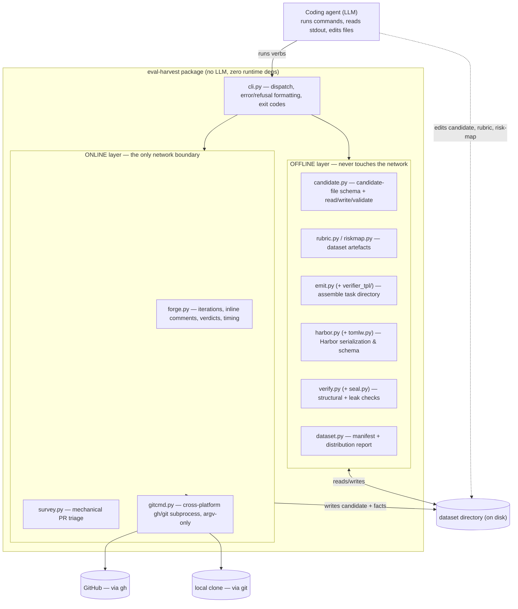
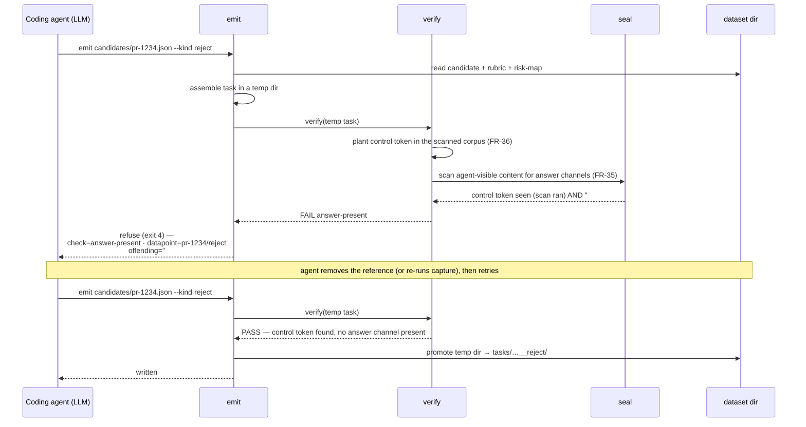

# Technical Spec: eval-harvest — agent-native CLI for building PR-review eval datapoints

**PRD:** [prd.md](./prd.md)
**North Star:** An SDE with pull requests piling up wants to automate approvals and does not trust an agent to do it. They point a coding agent at this CLI and get Harbor review-eval datapoints built from their own repository's PR review history — fast enough to have them today, without hand-labelling a pull request or learning eval methodology — so they can empirically validate their PR agent, tune it, and switch on automated approvals for low-risk changes.
**Author:** Tanner McRae
**Status:** Draft

---

## 1. Context from the PRD

Carried forward so this document stands on its own. The product case is argued in the PRD and the decisions log; it is not re-argued here.

- **North star:** as above (PRD §1).
- **Primary customer:** an SDE responsible for one or more repositories, with PRs piling up, who wants to automate approvals for low-risk changes and will not switch that on until they can show the agent is good enough. They arrive not knowing what an eval is, drive the tool through a coding-agent harness (Claude Code, Kiro, …), and expect to type a sentence (PRD §3).
- **Problem:** building a PR-review eval by hand requires a skill the customer lacks (deciding per-PR what a good reviewer should have said, encoding it into a sealed runnable task). So the automation stays off. The measurable cost of the status quo is unmeasured — PRD carries `[TODO: measure hours per tuning cycle]` (PRD §2, §5).
- **User stories in scope:**

  | Story | Title | Acceptance criteria (summary) |
  |-------|-------|------------------------------|
  | US-1 | Docs sufficient to drive it unsupervised | `--help`/man pages carry the *methodology*; an agent given only repo name + help output produces valid datapoints; every error is model-actionable; no LLM in the CLI; every command human-usable |
  | US-2 | Mine a PR's review iterations into good/bad candidates | Per PR: each iteration's tip/base SHA, diff, review comments bound to it; verdicts + timing; squash/rebase recoverable via `refs/pull/<n>/head`; facts not labels; deterministic; refuse repos with no review iteration |
  | US-3 | Capture the human review as the datapoint's oracle | Each comment captured (body, path, line range, author role, timestamp, iteration); material to separate defects from nits + recorded per-comment decision; every finding carries severity low/med/high (high the only blocking severity); expected verdict follows the human review state (`--kind`), enforced by invariant not derivation; severity evidence recorded; post-iteration comment usable as reference but never agent-visible; nits-only → approve datapoint; no-comment → unusable for should-flag |
  | US-4 | Classify how risky the change is | Each datapoint carries change-risk low/med/high independent of findings/verdict; determined structurally (path rules) **and** by classification, both recorded; disagreement recorded; path rules a first-class versioned artefact; CLI reports risk distribution |
  | US-5 | Build the rubric from the team's conventions | Docs instruct agent to build a rubric first (overlay repo conventions on a standard base); CLI surfaces stated-convention files; rubric a first-class versioned artefact; datapoint records rubric version |
  | US-6 | Emit a self-contained Harbor task directory | Directory with `environment/Dockerfile`, change as a patch, `instruction.md`, `tests/`, `task.toml`, and a verifier-only `solution/`; `[metadata.origin]` provenance; sealing Dockerfile; `tests/` holds judge + rubric; `separate` verifier mode; uniform `instruction.md` modulo declared slots |
  | US-7 | Verify each datapoint tests the right thing | Per datapoint: base exists, patch applies, oracle findings reference real lines, rubric coherent; answer absent from every channel the agent can read (incl. non-obvious git channels); planted control token + refusal when absent; every check watched to fail; failing datapoint not emitted (override explicit + recorded); failures reported actionably |

- **Out of scope (must not creep back in):** running evals / scoring / ranking / error bars / paired comparison; **aggregating** severity into an automation-gate score and the taste judge; the automated-approval CI integration; non-GitHub forges; eval types other than PR review; pooling history across repositories; a human verification step; **any LLM inside the CLI**; synthetic/injected defects; the conformance spec, requirement ids, L1/L2/L3 levels, extension wire protocol, content-addressed store, evidence graph, publication/governance/leaderboard (PRD §10, CLAUDE.md).
- **Open PRD questions still unresolved (carried verbatim, not answered here):**
  - `[TODO: set target]` for the core-bet success metric (fraction of datapoints an unsupervised agent builds that pass every US-7 check). Straw man in PRD §8: 80% first-attempt, 100% after the agent acts on CLI feedback. **Workstream G's eval (G-3) sets this or records it as still open with the straw man** — it is no longer resolved in this doc.
  - `[TODO: measure]` time to hand-build a 50-datapoint eval; hours per tuning cycle (PRD §2, §5).
  - `[TODO: measure]` nits-vs-defects ratio on a real repository (PRD §9).
  - `[TODO: prove with one real dispatched trial]` that `LambdaMicrovmsEnvironment` loads by import path into an unmodified Harbor (PRD §4, §9; the `import_path` code path is cited in §3 Constraints, but not yet run).
  - `[TODO: confirm]` Lambda MicroVMs credentials/bucket/build-role/quota exist (PRD §9). Needed for any US-7 check or oracle probe that must build a container.
  - `[TODO: set threshold]` for the §4 hand audit (≥20 datapoints) before any score is quoted.
  - The finding-audit (PRD §4) is a **prerequisite to trusting output**, not a build gate. It is a human process, out of this plan's implementation scope, but the plan must not make it impossible — every emitted datapoint records the evidence a human auditor needs.

The PRD flags itself as **problem-validated, cost-and-sizing-unmeasured**. This spec inherits that: the build is not gated on the sizing TODOs.

## 2. Requirements

### 2.1 Functional Requirements

Every FR maps to a user story. "The CLI" throughout is the `eval-harvest` command; "the agent" is the driving coding-agent harness; "the customer" is the human.

| Req ID | User Story | Requirement | Acceptance Criteria |
|--------|-----------|-------------|--------------------|
| FR-1 | US-1 | `--help` and per-verb man pages carry the methodology, not just flags: what makes a review datapoint valid, why the base commit precedes the change, why the instruction must not name the outcome, what a defect is versus a nit, and how to obtain the local clone the verbs read | `eval-harvest <verb> --help` for every verb contains a methodology section; a reviewer can point to the sentence teaching each of those items |
| FR-2 | US-1 | Every error and refusal names the check that failed, the datapoint/PR, the specific offending content, and the next command to run | Trigger each refusal; stderr contains all four fields; exit code is non-zero and distinct per class |
| FR-3 | US-1 | The CLI contains no LLM/model client anywhere in its dependency tree | `pyproject.toml` runtime deps are empty or contain no model SDK; an import-scan check (see FR-3 test) finds no `openai`/`anthropic`/`litellm`/HTTP-to-model-endpoint import |
| FR-4 | US-1 | Every command is usable by a human in the same shape with the same output as the agent uses | Each verb runs from a shell with no agent present and produces identical bytes to an agent invocation with the same args |
| FR-5 | US-2 | A `survey` verb reports, per PR, the mechanical facts that decide whether it is harvestable, and never a quality label | Emits per-PR `blockers`, SHAs, changed paths, review rounds; no field asserts "good"/"bad" |
| FR-6 | US-2 | A `capture` verb reports, for one PR, each review iteration: tip SHA, base/parent SHA, diff against base, and which review comments landed against it | For a PR with N review rounds, output enumerates N iterations each with its SHAs, a unified diff, and the comment ids bound to it; an iteration whose tip was force-pushed away and is unreachable is reported as unrecoverable, not fabricated |
| FR-7 | US-2 | `capture` reports each review verdict (approve/request-changes/comment) and its timestamp, so an agent can tell a rejected state from an approved one | Output lists every review submission with `state` and `submittedAt`, ordered |
| FR-8 | US-2 | Squash-merged and rebased PRs remain recoverable: pre-merge states come from `refs/pull/<n>/head` where the commit graph has lost them | For a squash-merged PR whose branch was deleted, `capture` still yields the change tip and diff (fetched via `+refs/pull/*/head`) |
| FR-9 | US-2 | The CLI records the agent's classification of each fact with the evidence behind it, and itself emits no classification | Candidate file (§8) has agent-writable slots for every judgment; CLI-written fields are mechanical only |
| FR-10 | US-2 | Running `survey`/`capture` twice over unchanged history produces byte-identical output | Run each twice against a fixed clone + fixed `gh` payload; `diff` is empty |
| FR-11 | US-2 | A repository whose PRs merge without review iteration produces a refusal naming that fact and the count that justified it, not an empty dataset | Against a repo with 0 reviewed PRs, `survey`/`dataset` refuses with `no-review-iteration` and the reviewed-PR count |
| FR-12 | US-3 | Each review comment is captured with body, file path, line range, author association/role, timestamp, and the iteration it was written against | `capture` output for each inline comment carries all six fields |
| FR-13 | US-3 | The candidate file exposes the material to separate defect findings from nits/questions/approvals/bot output, and records which way the agent decided per comment and why | Candidate schema has a per-comment `classification` + `rationale` slot; CLI leaves them empty; `verify` requires them filled |
| FR-14 | US-3 | Every reference finding carries a severity (low/medium/high), with high the only blocking severity; the datapoint's expected verdict follows the human review state selected by `--kind` (reject⇒block, approve⇒approve), not a severity formula | `emit` sets `expected_verdict` from `--kind`; refuses a `--kind approve` candidate that carries any high-severity finding, and a `--kind reject` candidate with no substantive finding (`empty-oracle`); records `blocking_severity = "high"` |
| FR-15 | US-3 | The evidence behind each severity assignment is recorded (what in the review indicated it, what the agent concluded) | Candidate/finding schema has `severity_evidence` + `severity_rationale`; `verify` refuses a finding missing them |
| FR-16 | US-3 | A comment written after the datapoint's iteration is usable as a reference finding when it describes a defect present in that iteration, but never appears where the evaluated agent can read | Such a comment can be marked `reference_only`; `emit` places it in `tests/` (verifier-only), never in `instruction.md` or the agent-visible tree; `verify` confirms its text is absent from agent-visible content |
| FR-17 | US-3 | A PR whose only review comments are nits is usable as an **approve** datapoint with the nits recorded non-blocking | A candidate with all findings severity=low emits an approve datapoint; nits recorded in `tests/` as non-blocking findings |
| FR-18 | US-3 | A PR with no review comments at all is reported unusable for a should-have-been-flagged datapoint, rather than emitted with an empty oracle | `emit --kind reject` on a comment-less PR refuses with `empty-oracle` |
| FR-19 | US-4 | Every datapoint carries a change-risk classification (low/medium/high) independent of its findings and verdict | `task.toml` `[metadata.origin]`/`[metadata.harvest]` carries `change_risk`; a low-risk rejected datapoint and a high-risk approved datapoint are both representable |
| FR-20 | US-4 | Change risk is determined two ways and both recorded: structurally from supplied path rules, and by the agent's classification with its reasoning | Candidate carries `risk_structural` (computed by CLI from path rules) and `risk_classified` (+rationale, agent-supplied); both survive into `task.toml` |
| FR-21 | US-4 | Where the two disagree, the datapoint records the disagreement rather than silently preferring one | When `risk_structural != risk_classified`, `emit` writes both and a `risk_disagreement=true` marker; neither is dropped |
| FR-22 | US-4 | Path rules are a first-class inspectable artefact, versioned with the dataset like the rubric | `risk-map.toml` (or `.json`) at the dataset root, referenced by version from each datapoint |
| FR-23 | US-4 | The CLI reports the risk distribution across the dataset | `dataset`/`report` verb prints counts per change-risk level and per finding-severity level |
| FR-24 | US-5 | The CLI's docs instruct the agent to construct a rubric before any datapoint, describing how (overlay repo conventions on a standard base) | `init`/`rubric --help` contains the instruction and the overlay method |
| FR-25 | US-5 | The CLI surfaces the repository's stated conventions where they exist as files | An `init`/`conventions` verb lists/【emits paths to】 `CONTRIBUTING*`, `.github/`, `CODEOWNERS`, style-guide files it finds in the clone |
| FR-26 | US-5 | The rubric is a first-class artefact: written down, inspectable, versioned with the dataset, reusable | `rubric.md` (+ a version) at the dataset root; multiple datapoints reference the same version |
| FR-27 | US-5 | A datapoint records which rubric version it was built against | `task.toml` carries `rubric_version` |
| FR-28 | US-6 | `emit` produces a self-contained Harbor task directory: `environment/Dockerfile`, the change as a patch, `instruction.md`, `tests/`, `task.toml`, with no external state required | Emitted directory builds/runs under Harbor with no network beyond the sealing clone; `validate_task_layout`-equivalent checks pass |
| FR-29 | US-6 | `task.toml` records provenance in Harbor's own shape: repo, PR number(s), base commit, dates | `task.toml` `[metadata.origin]` carries `repo`, `pr_numbers`, `base_commit`, `base_commit_date`, `merged_at` |
| FR-30 | US-6 | The Dockerfile seals the container against the repo's future: shallow single-branch no-tags clone, reset to base, remotes removed, remote refs deleted, reflog expired, unreachable pruned | Emitted `environment/Dockerfile` contains each sealing step; a build produces a tree the git-channel absence checks pass on |
| FR-31 | US-6 | `tests/` holds the judge and the rubric it grades against, as files inside the task | Emitted `tests/` contains the verifier script(s), the oracle findings, the rubric, and the pinned judge config |
| FR-32 | US-6 | Tasks are emitted in `separate` verifier environment mode | `task.toml` `verifier.environment_mode = "separate"`; emit refuses `shared` |
| FR-33 | US-6 | `instruction.md` presents the same text across datapoints modulo declared slots | Two datapoints' `instruction.md` differ only in declared slot values; a diff outside slots is a refusal |
| FR-34 | US-7 | `verify` checks per datapoint: base commit exists, change applies cleanly at it, oracle findings reference files/lines that exist in the change, rubric coherent | Break each precondition; `verify` reports the specific failure |
| FR-35 | US-7 | `verify` checks the answer is absent from everywhere the evaluated agent can read, in two scans: (a) the non-obvious **git-channel** checklist (the channels a git repo leaks its own future through), and (b) a **content** scan that greps every agent-visible file (`instruction.md`, `change.patch`, any agent-mounted tree) for the PR number, review text, and answer tokens | Both scans run; a planted leak in a git channel *or* in agent-visible file content fails, each naming the file/line |
| FR-36 | US-7 | A scan that finds nothing proves it scanned something: a planted control token, and a refusal when the scan returns without finding it | Remove the control token from the scanned corpus; `verify` refuses with `scan-did-not-run` |
| FR-37 | US-7 | Every US-7 check has been watched to fail: the invariant is broken deliberately, the check goes red, the break reverted, and that is recorded | A committed test per check breaks the invariant and asserts red; a recorded artefact lists each check + the test that exercised it |
| FR-38 | US-7 | A datapoint failing any check is not emitted; overriding is possible, explicit, and recorded in the datapoint | `emit` runs `verify` and refuses on failure unless `--override <check>` is passed, which records the override in `task.toml` |
| FR-39 | US-7 | Failures are reported so the agent can fix and retry: naming the check, the datapoint, the offending content, and what to do | Same shape as FR-2, exercised by every US-7 refusal |
| FR-40 | US-6 | `emit` writes a verifier-only `solution/solve.sh` that emits the reference findings, used to prove the reward stack responds to a known-good submission; it is never placed where the evaluated agent can read it | Emitted task has `solution/solve.sh`; it is excluded from the agent-visible environment and included in the FR-35 content scan's "must be absent from agent-visible content" corpus |

### 2.2 Non-Functional Requirements

| Req ID | Category | Requirement | How Measured | Driver |
|--------|----------|-------------|-------------|--------|
| NFR-1 | Reproducibility | `survey`, `capture`, and `emit` are byte-identical functions of their inputs (fixed clone + fixed `gh` payload for the first two; candidate file + artefacts for `emit`). No wall-clock, no hash-seed, no dict-order dependence in output | Run twice, `diff` empty; a golden-file test | US-2 AC (identical output), US-6 (Harbor content hash stability) |
| NFR-2 | Security / sealing | `emit` and `verify` make no network call and no `gh`/`git remote` call; the answer-sealing path can never reach the forge | Run with network disabled; a test asserts no `gh` invocation and no `git fetch`/remote op in these verbs | US-7, PRD §4 (a leaked answer measures nothing) |
| NFR-3 | Dependency integrity | No LLM/model client in the runtime dependency tree | Dependency audit + import scan in CI (FR-3) | US-1 AC (no model client), decisions log |
| NFR-4 | Compatibility | The CLI runs identically on Windows and macOS (and Linux) | CI matrix (windows-latest, macos-latest, ubuntu-latest) runs the suite green | User constraint ("work the same with windows and mac") |
| NFR-5 | Simplicity | Zero third-party **runtime** dependencies (dev-only: ruff, pytest, and a type checker) | `pyproject.toml` `[project].dependencies == []`; a test asserts it | User constraint ("as few deps as possible … small and simple") |
| NFR-6 | Scanner honesty | Every absence scan (FR-35) plants and requires a control token before trusting an empty result | Guard-verification test (FR-36): remove token → scan refuses | US-7, CLAUDE.md ("a scanner that finds nothing must prove it scanned something") |
| NFR-7 | Performance (forge cost) | `survey` costs one `gh` GraphQL query per page; `capture` for one PR costs a bounded number of round trips `[TODO: set target — measure round trips per PR against a reference repo; the reviews+comments+timeline fetch is the cost driver]` | Count `gh`/`git` invocations per PR in a test | PRD §1 ("fast enough to have them today") |
| NFR-8 | Portability of tasks | The **emitted task** always targets Linux containers regardless of the host the CLI ran on | Emitted `task.toml` `environment.os = "linux"`; the sealing Dockerfile uses POSIX git | US-6, Harbor task-portability constraints |

Categories that do not apply, stated explicitly: **Scale** — the working set is one repository's PRs on one developer's machine; there is no multi-tenant or concurrency target beyond NFR-1's determinism. **Privacy/data-retention** — the CLI reads a repo the customer already owns and writes to the local filesystem only; it stores no data server-side and transmits nothing except the `gh`/`git` reads the customer authorizes. **Migration** — there is nothing to migrate; this is a greenfield branch. **Cost (compute)** — the CLI dispatches no runs (PRD §7); Lambda MicroVMs cost applies only to the deferred eval-running work.

### 2.3 Technical Prerequisites

| Req ID | Prerequisite | Why it's required |
|--------|-------------|------------------|
| TP-1 | A `uv`-managed package with a console entry point, `mise.toml` dev tasks, and ruff configured | The feature ships several verbs behind one installable command (Phase-2 decision); there is no manifest on this branch yet, and every FR lands as a module inside it. Nothing builds without it |
| TP-2 | A deterministic, hand-rolled TOML **writer** (stdlib `tomllib` reads; nothing in stdlib writes) | NFR-1/NFR-5: `task.toml` and the dataset artefacts must be emitted byte-stably with zero deps. A hand-rolled writer is needed for exactly this digest-stability reason, which a library writer does not guarantee |
| TP-3 | Forge capture must fetch inline review comments + review timing via the timeline/comments REST endpoints, not `gh pr view --json reviews` | `reviews` returns verdict-level reviews only — no per-line comments with path + line range — so US-3 (FR-12) is impossible without the REST endpoints |
| TP-4 | A stdlib-only Harbor serializer carrying the correct `task.toml` constants and schema-validation functions | US-6 correctness depends on Harbor behavioural facts (§3) that Harbor's docs get wrong; the constants and `validate_*` functions must reproduce Harbor's actual behaviour and be written as plain functions (D-2) |
| TP-5 | A stdlib-only answer-absence checker: the git-channel checklist **plus** a content scanner over agent-visible files | US-7's leak scan is two halves — a **git-channel checklist** enumerating the places a git repository leaks its own future while looking clean (`objects/info/alternates`, `packed-refs`, the commit graph, `refs/replace`, reflog entries outside reachability, `include.path` in the config), and a **content scan** that greps agent-visible files for the PR number / review text / answer tokens, guarded by a planted control token. Both are stdlib-only code this project writes (E-1) |

## 3. Constraints

Hard limits, cited to source.

- **No LLM anywhere in the CLI.** Vends facts and instructions only; the driving agent supplies every judgment. Checkable via dependency tree (decisions log; PRD §7; CLAUDE.md). An LLM judge shipped *inside a task file* does not violate this — the CLI writes it, Harbor runs it at eval time.
- **The execution environment is a separate component the CLI never imports.** The Lambda MicroVMs environment and the `microvms` bindings it drives are built as their own workstream (Workstream H); the `eval-harvest` package depends on none of it at runtime. The CLI only emits tasks that Harbor + that environment later run — so the emitter must honour Harbor's contract, but nothing under `src/eval_harvest/` links against the environment.
- **Harbor is the output format, and these facts about its behaviour are binding** (Workstream D builds `harbor.py` against them): Harbor discards the verifier exit code and reads only a reward file; `separate` verifier mode is mandatory or the agent can pre-plant a passing reward; in `separate` mode the verifier image is built from `tests/` and `tests/` is not uploaded at runtime, so the image self-provides its verifier; unknown `task.toml` keys load then vanish, so provenance goes under `[metadata.*]` — the only other key Harbor preserves is a top-level `source`, which this design does not use; the local/registry/repo consumption paths fall back to `Mean()` and ignore a dataset `metric.py`, so every reward key must be meaningful when averaged.
- **No fork of Harbor is required.** `EnvironmentFactory.create_environment_from_config` honours `config.import_path`, so `LambdaMicrovmsEnvironment` loads by import path into an unmodified Harbor — this is the wiring Workstream H (H-3) builds against. **The design depends on this being run, not just read** — the one dispatched proving trial stays a PRD `[TODO]`.
- **`survey`'s output is byte-stable and pinned by a golden-file test.** Every collection it emits is ordered by a stable key, so two runs over a fixed clone + `gh` payload are byte-identical; a committed golden payload is what catches a drift in a key, a range, or a field (FR-5, FR-10, NFR-1).
- **No `docs/spec/`, requirement ids, or conformance level.** One implementation, one customer (CLAUDE.md). The FR/NFR ids in this document are planning aids local to the spec, not a shipped requirement graph.
- **Determinism budget.** No `datetime.now()`, no unseeded set/dict iteration in any emitted bytes; timestamps in output come from the forge/commit data, never the wall clock (NFR-1 — the candidate's timestamp, never the wall clock).
- **Security: untrusted repo content never reaches a shell.** All `git`/`gh` calls build `argv` lists, never shell strings, and disable prompts (enforced in the `gitcmd.py` chokepoint); commit messages, PR titles, and review bodies are data, never interpolated into commands.

## 4. Risks & Mitigations

| Risk | Likelihood | Impact | Mitigation | Early warning sign |
|------|-----------|--------|------------|-------------------|
| **Core bet fails:** an unsupervised agent produces plausible-looking garbage from the CLI's help alone | Med | High (the product's premise) | The eval, **Workstream G**: run the finished CLI in the Lambda MicroVMs environment (Workstream H) against Claude Code on Bedrock (2 objectives × k=3), then grade each built datapoint with `verify` **and** a human-aligned quality judge, plus tool-use/trajectory metrics — a re-runnable, extensible eval, not a one-shot writeup (PRD §4/§8/§9) | Low pass rate across trials; agent skips building a rubric or mislabels nits as blocking findings |
| **Nits scored as defects:** a datapoint's oracle finding is a style preference, teaching the eval that bikeshedding is good review | High | High | Per-comment classification recorded with evidence (FR-13) so a bad rule is findable; severity on every finding (FR-14); the §4 human audit before any score is trusted | The nits-vs-defects ratio (PRD `[TODO]`) comes back mostly nits |
| **Leaked answer:** the fix, review discussion, PR number, or follow-up commit reachable from agent-visible content — every score then looks fine and measures nothing | Med | High | FR-35 git-channel + content scan + FR-36 control token; `separate` verifier mode (FR-32); `no-network` agent environment; every check watched to fail (FR-37) | Control-token scan passes on a datapoint you know contains a leak |
| **Reviewing an iteration tip ≠ reviewing what shipped:** a squash-merged PR's merged content can differ from any branch tip | Med | Med | Seal the tip so rejected and approved states are structurally identical; state the fidelity gap in the datapoint provenance rather than hide it (PRD §9) | `branch_changed_paths` disagrees with the integrated diff (surfaced by the `survey` verb) |
| **Force-pushed iterations unrecoverable:** `refs/pull/<n>/head` is a single tip, so a round-1 state later force-pushed away may be GC'd on the forge and unfetchable | Med | Med (fewer reject datapoints on some repos) | `capture` recovers added-commit iterations and the final pre-merge tip; when an iteration tip is unreachable it is reported as unrecoverable rather than fabricated, and that PR simply yields fewer datapoints | `capture` names an iteration tip it cannot fetch |
| **Harbor behaviour drifts from the mirrored constants** (TP-4 mirrors a specific Harbor version structurally) | Low | Med | Record the mirrored Harbor version in a constant (e.g. `SCHEMA_MIRROR_SOURCE`); a `[TODO]` drift check against a real Harbor checkout when one is available; validate emitted `task.toml` against the mirror before writing | An emitted task errors at `harbor run` on a schema field |
| **Lambda MicroVMs access unproven:** US-7 container-build checks and the import-path trial need somewhere to execute | Med | Med (degrades v1, does not block it) | v1 `verify` does static checks on shipped files + a locally-materialized seal; the container-build seal check and the import-path trial are gated on the PRD's credential `[TODO]` and degrade to skipped-with-reason, never silently passed | `verify` reports a seal check as "skipped (no runtime)" and someone reads it as "passed" |
| **Cross-platform git internals:** a naive wrapper would hard-code `HOME=/nonexistent` and `os.defpath`, POSIX-isms | Low | Low | A cross-platform subprocess wrapper (NFR-4); CI matrix on Windows + macOS | Windows CI red on a `git`/`gh` invocation |

**Accepted without mitigation:** market sizing and status-quo cost (PRD `[TODO]`s) — the PRD explicitly does not gate the build on them. The **second assumption** (human review comments are a usable, if incomplete, reference) is accepted structurally: the reward object treats unmatched agent findings as *uncredited*, not false (FR carried into the emitted verifier), which is the seam that lets the incompleteness be corrected later without re-mining.

## 5. Proposed Solution

### 5.1 The mental model: the agent drives, the CLI knows the rules

`eval-harvest` works like `gh`. It is a plain command-line tool with no intelligence of its own: it fetches facts from GitHub, checks them, and writes files. Every *judgment* lives in the **coding agent** the customer already uses. The customer types one sentence — "build me a PR-review eval from `our-org/our-repo`" — and the agent does the rest by running `eval-harvest` commands, reading their output, making the calls only a reasoner can make, and running more commands.

The agent and the CLI communicate through exactly two channels and nothing else:

- **The CLI's stdout** — facts and instructions the agent reads. This is why the help text *is* the product: it is the only place the methodology lives (US-1).
- **Files in a shared dataset directory** — where the agent writes the judgments the CLI later reads back.

The CLI never calls a model; the agent never sees inside the CLI. And state lives on the filesystem, not in a running process — each command is a short-lived process that reads and writes the dataset directory, exactly as `git` subcommands share one `.git`. The agent is the orchestrator that runs them in sequence; the CLI holds no session.

### 5.2 The dataset directory, and the candidate file at its centre

Everything the agent builds accumulates in one directory (full shapes in §8):

```
<dataset>/
  rubric.md            # the team's review rubric, agent-authored, versioned          (US-5)
  risk-map.toml        # path rules: which directories are high-risk, versioned       (US-4)
  candidates/
    pr-1234.json       # one PR's captured facts + the agent's judgments              (US-2,3,4)
  tasks/
    <name>__reject/    # an emitted Harbor task directory                             (US-6)
    <name>__approve/
  dataset.toml         # the Harbor dataset manifest                                  (US-6)
```

The **candidate file** is the hand-off artefact and the most important object in the design. `capture` writes it full of *mechanical facts* with the *judgment slots blank*; the agent fills the slots; `emit` reads both halves back. Because it is a plain, inspectable file, the agent's reasoning is auditable (the PRD §4 human audit reads it), re-runnable (re-emitting from an unchanged candidate is byte-identical), and correctable (a bad call is one editable field, not a diffuse rule). It is the concrete form of the decisions-log rule "the driving agent proposes labels; the CLI never does."

### 5.3 What each command contributes

The full agent-driven sequence is §7.1 and the input/output contracts are §9; this is the one-line-each summary that ties the FRs to the flow.

1. **`init`** scaffolds the dataset directory and shows the agent the repo's own convention files, then instructs it to author `rubric.md` and `risk-map.toml` (FR-24, FR-25).
2. **`survey`** lists which PRs are harvestable and why the rest are not, and refuses outright if the repo does not review its PRs (FR-5, FR-11).
3. **`capture <pr>`** is the deep fetch: every review iteration's tip/base SHA and diff, every inline comment bound to its iteration (path, line, role, timestamp), every verdict and its timing. It writes the candidate file with those facts and blank judgment slots, and pre-computes the structural change-risk from `risk-map.toml` (FR-6–FR-13, FR-16, FR-20).
4. **The agent fills the candidate** — per comment: defect or nit, and why; per finding: a severity with its evidence; the change's own risk classification with reasoning. No CLI call; this is the judgment step (FR-14, FR-15, FR-19–FR-21).
5. **`emit <candidate> --kind reject|approve`** turns the filled candidate into a self-contained Harbor task directory (a should-have-been-flagged datapoint from a rejected iteration, an approve datapoint from the approved state): sealed Dockerfile, the change as a patch, a uniform `instruction.md`, `tests/` holding the oracle + rubric + judge, and `task.toml`. The expected verdict follows the human review state the datapoint is built from — `--kind reject` expects *block*, `--kind approve` expects *approve* — never a severity formula; `emit` enforces the coherence invariants (a reject needs ≥1 substantive finding, an approve carries no high finding) so "should this block?" and "what was wrong?" cannot disagree within one datapoint (FR-14, FR-28–FR-33). `emit` runs `verify` first and refuses to write a failing datapoint unless an explicit, recorded `--override` is given (FR-38).
6. **`verify <task-dir>`** is the guarantee that replaces the absent human: base commit exists, patch applies, findings point at real changed lines, rubric coherent (FR-34), and the answer is absent from every channel the evaluated agent can read — the git-channel checklist over agent-visible content, with a planted control token so an empty scan proves it ran (FR-35, FR-36). Every check ships with a test that breaks the invariant and watches it go red (FR-37).
7. **`dataset`** assembles `dataset.toml` and reports the risk/severity distribution, so the customer sees whether they have enough low-risk datapoints to justify switching automation on (FR-23).

**Context-economy verbs.** Ten datapoints are ten *independent* units of judgment, and the facts each one needs already live in the candidate — so the agent should never pay to re-derive them from raw patch bytes or re-read a whole candidate to change one field. Four verbs keep the per-PR fill cheap and self-contained:

- **`show <candidate> <comment-id>`** renders only the diff hunk(s) whose new-side span covers one comment's line range, so the agent sees what a comment points at without reading the whole patch. Overlap is decided by the one span parser (`diffspan.py`), so `show` and `verify` never disagree about which hunk a line falls in.
- **`brief <candidate>`** prints one self-contained hand-off for filling one PR's candidate — identity, change risk, recoverable iterations, which `--kind`s are buildable, every comment with its in-diff markers, the fill contract, and the exact next commands — and *no* diff bytes (that is `show`'s job, on demand). A driver hands one PR's brief to a fresh subagent so the fill work stops accumulating in one context.
- **`annotate <candidate>`** takes the agent's judgments as a stream of small per-comment/per-finding/risk records on stdin and merges each into the candidate, so a fill or a correction never rewrites the whole file. The merge is a pure function; the CLI still writes no judgment (FR-9) and infers nothing (no defaulted severity or `reference_only`).
- **Batch mode** (`capture`/`emit` `--batch`) runs one unchanged verb over many items one at a time, containing each item's refusal *and* any unexpected exception so neither aborts the rest, so a driver never hand-writes a shell loop. The single-item `--json` payload shape is reused verbatim per batch item, so one schema parses across single and batch runs.

### 5.4 What v1 knowingly simplifies

The verifier the CLI writes *into each task* is the one place v1 under-satisfies a story's spirit, called out here rather than discovered later. PRD §4 requires the reward object to keep coverage and precision separate and treat unmatched agent findings as *uncredited*; the matcher must narrow deterministically before it calls the pinned judge. v1 ships that *shape* — path+line narrowing, an LLM judge for semantic equivalence, separate coverage/precision reward keys, per-severity counts — but simplifies the full one-to-one maximum-cardinality assignment to a greedy match and drops the versioned taxonomy-equivalence table. Severity *aggregation* into a single automation-gate score and the taste judge are out of scope entirely (PRD §10). ADR-5 carries the argument.

## 6. Architecture

The feature adds one component — the `eval-harvest` package. The Lambda MicroVMs execution environment (Workstream H) is a separate component the package never imports. The Harbor emitter and the answer-absence checker are written against Harbor's behaviour and the known git-leak channels (D-2, E-1).

### 6.1 The two layers, and the one thing they share

The package splits cleanly in two, and the split is the security boundary the product rests on. An **online layer** is the only code that touches the network; an **offline layer** does everything else and never makes a network call (NFR-2). They never call each other directly — they communicate only through files in the dataset directory. That is what lets the answer-sealing path (in the offline layer) be provably unable to reach the forge: it has no code path to it.



| Module | Responsibility | Layer | Notes |
|--------|---------------|-------|-------|
| `cli.py` | Parse args, dispatch to a verb, format every refusal in the FR-2 four-field shape, set exit codes | — | The only surface the agent's shell touches |
| `gitcmd.py` | One cross-platform wrapper for every `gh`/`git` call; argv lists never shell strings; prompts disabled | online | TP-1/NFR-4; naive POSIX-isms (`HOME=/nonexistent`, `os.defpath`) get made portable here |
| `forge.py` | Fetch a PR's iterations, inline comments, verdicts, timing (TP-3 — the `gh api` + `git fetch +refs/pull/*/head` work `survey` does not do); bind each comment to the iterations whose diff covers it (`in_diff_iterations`) | online | |
| `survey.py` | Mechanical PR triage; fetches the pull refs and refuses when nothing is harvestable; output pinned to a committed golden payload by a test | online | Golden-file determinism (FR-10, NFR-1) |
| `diffspan.py` | The single unified-diff span parser: which file+line span a hunk covers, used by `forge`, `show`, and `brief` so there is exactly one span parser | offline | The keystone the context-economy verbs share (ADR-6) |
| `candidate.py` | The candidate-file schema; scaffold-with-facts; read-back + slot-coherence validation; `capture` refuses a PR that cannot yield a datapoint | offline | The data contract between `capture` and `emit` (ADR-3) |
| `show.py` | The `show` verb: print the diff hunk around one comment, so the agent reads a few lines instead of the whole patch | offline | Context economy (ADR-6) |
| `brief.py` | The `brief` verb: one self-contained per-PR brief that hands a fresh agent everything it needs for that PR | offline | Context economy (ADR-6) |
| `annotate.py` | The `annotate` verb: append-only per-comment fill, so the agent writes one judgment without rewriting the candidate | offline | Context economy (ADR-6) |
| `batch.py` | Batch mode for `capture` and `emit` (`--batch`), so the agent drives many PRs in one call instead of writing a shell loop | offline | Context economy (ADR-6) |
| `diffspan.py` | The one new-side unified-diff span parser: which line spans a diff's hunks touch, per file | offline | Single implementation both `candidate.py` (comment↔iteration binding) and `verify.py` (finding-line check) call; no second copy |
| `show.py` | The `show` verb: render only the hunk(s) covering one comment's line range | offline | Read-only view over `capture`'s output; overlap decided by `diffspan.py` |
| `brief.py` | The `brief` verb: one self-contained per-PR fill hand-off, no diff bytes | offline | Pure rendering of candidate facts + the fill contract; suggests no classification (FR-9) |
| `annotate.py` | The `annotate` verb: merge a stream of per-comment fill records into the candidate | offline | Pure merge (data in, candidate + violations out); CLI writes no judgment, infers nothing (FR-9) |
| `batch.py` | Batch mode for `capture`/`emit`: run one verb over many items, containing each item's refusal/exception | offline | Verb-agnostic loop; single-item `--json` payload reused per item (FR-2) |
| `rubric.py` / `riskmap.py` | Surface convention files; parse `risk-map.toml`; apply path rules to compute structural risk | offline | |
| `harbor.py` (+`tomlw.py`) | Harbor `task.toml` constants (built from reading Harbor's source) + `validate_task_config`/`validate_task_layout`; deterministic TOML writer | offline | TP-2, TP-4 |
| `emit.py` (+`verifier_tpl/`) | Turn a filled candidate into a task directory; set verdict from `--kind`; materialize the in-task verifier from templates | offline | Calls `verify` before writing (FR-38) |
| `seal.py` | The answer-absence scan: the git-channel checklist **plus** a content scan of agent-visible files for the PR number / review text / answer tokens | offline | TP-5 |
| `verify.py` | Structural checks + absence scan + control token; refuse/override; FR-39 messages | offline | |
| `dataset.py` | Assemble `dataset.toml` + registry; risk/severity distribution report | offline | |

The **in-task verifier** materialized from `verifier_tpl/` is the only code that runs at Harbor eval time. It is written as files into each task's `tests/`; the CLI never imports or runs it. That is how "the CLI contains no LLM" and "a task ships an LLM judge" are both true (Constraint; ADR-5).

### 6.2 The filesystem is the bus — how commands hand data off

There is no in-memory pipeline. Each command reads some files and writes others, and the *files* carry state between commands. This table is the data-flow contract that §7's sequence diagrams animate:

| Command | Reads | Writes | Hands off to |
|---------|-------|--------|-------------|
| `init` | convention files in the clone | dataset skeleton, `rubric.template.md`, `risk-map.template.toml` | the agent (authors `rubric.md`, `risk-map.toml`) |
| `survey` | `gh` PR list, `git` mainline | nothing (optional `--cache`) | the agent (picks PRs) |
| `capture <pr>` | `gh`/`git` (PR iterations + comments + verdicts), `risk-map.toml` | `candidates/pr-<n>.json` (facts + blank slots + `risk_structural`) | the agent (fills slots via `annotate`), then `emit` |
| `show <candidate> <comment-id>` | the candidate + its materialized patch | nothing | the agent (judges the comment) |
| `brief <candidate>` | the candidate (+ `rubric.md` version) | nothing | a fresh agent context that fills the candidate |
| `annotate <candidate>` | the candidate + fill records on stdin | the candidate (rewritten byte-stably) | `emit` |
| `emit <candidate>` | the filled candidate (incl. the patch bytes `capture` materialized), `rubric.md`, `risk-map.toml` | `tasks/<name>__<kind>/` (or refuses) | `verify` (internally), then `dataset` |
| `verify <task-dir> [--clone]` | a task directory; the local clone for the base-tree checks | nothing | the agent (fixes and retries) |
| `dataset` | all `tasks/*` | `dataset.toml`, `registry.json` | `harbor run` |

Two invariants fall out of the table and are worth stating: only `capture` writes a candidate's *facts* and only the agent writes its *judgments* (FR-9), and only the online commands make a *network* call — `emit`/`verify`/`dataset` read only local files (the local clone included; reading a local `.git` with plain `git` is not a network call), which is NFR-2 made structural rather than promised: the guarantee is no forge contact, not no git.

## 7. Sequence Diagrams

### 7.1 A coding agent builds a dataset from one PR

The flow the product exists to enable: a coding agent turning one squash-merged PR into two datapoints, driven by the CLI's stdout and the candidate file. `Agent` is the driving LLM; every arrow into `CLI` is a shell command; every arrow into `FS` is a file read or write. The CLI is never called by the agent's model — the agent runs it as a subprocess.

```mermaid
sequenceDiagram
    actor Human
    participant Agent as Coding agent (LLM)
    participant CLI as eval-harvest
    participant FS as dataset dir (disk)
    participant GH as gh + git

    Human->>Agent: "Build a PR-review eval from our-org/our-repo"

    rect rgb(238,244,255)
    Note over Agent,CLI: 1. Learn the methodology from the tool itself (US-1)
    Agent->>CLI: eval-harvest --help ; eval-harvest capture --help
    CLI-->>Agent: verbs + methodology: what a valid datapoint is,<br/>why base precedes change, defect vs nit
    end

    rect rgb(238,255,244)
    Note over Agent,FS: 2. Scaffold, then author the artefacts (US-4, US-5)
    Agent->>CLI: eval-harvest init ./clone --dataset ./ds
    CLI->>GH: read CONTRIBUTING, .github/, CODEOWNERS
    CLI->>FS: write skeleton + rubric.template.md + risk-map.template.toml
    CLI-->>Agent: convention files found; "author rubric.md and risk-map.toml"
    Agent->>FS: write rubric.md (v1), risk-map.toml (v1)
    end

    rect rgb(255,250,238)
    Note over Agent,GH: 3. Triage — which PRs are harvestable (US-2)
    Agent->>CLI: eval-harvest survey --clone ./clone --repo our-org/our-repo
    CLI->>GH: gh pr list (one query) + git log --first-parent
    CLI-->>Agent: JSON: harvestable PRs + per-PR blockers<br/>(or refuse if the repo does not review PRs — see 7.3)
    end

    rect rgb(255,244,238)
    Note over Agent,GH: 4. Capture one PR's facts into a candidate (US-2, US-3, US-4)
    Agent->>CLI: eval-harvest capture 1234 --clone ./clone --dataset ./ds
    CLI->>GH: gh api pulls/1234/reviews, /comments, /timeline<br/>git fetch +refs/pull/1234/head
    CLI->>FS: read risk-map.toml → compute risk_structural
    CLI->>FS: write candidates/pr-1234.json<br/>(iterations, comments, verdicts filled; judgment slots blank)
    CLI-->>Agent: candidate path; "classify each comment, assign severity+evidence, add risk_classified"
    end

    rect rgb(244,238,255)
    Note over Agent,FS: 5. The judgment step — no CLI call (US-3, US-4)
    Agent->>FS: edit pr-1234.json: per comment defect|nit+why,<br/>per finding severity+evidence, risk_classified+rationale
    end

    rect rgb(238,255,255)
    Note over Agent,FS: 6. Emit two datapoints; each is verified before it is written (US-6, US-7)
    Agent->>CLI: eval-harvest emit candidates/pr-1234.json --kind reject
    CLI->>FS: read candidate + rubric.md + risk-map.toml
    CLI->>CLI: set verdict from --kind; assemble task; verify() (7.2)
    CLI->>FS: write tasks/…__reject/ (Dockerfile, change.patch, instruction.md, tests/, task.toml)
    CLI-->>Agent: written; all checks passed
    Agent->>CLI: eval-harvest emit candidates/pr-1234.json --kind approve
    CLI->>FS: write tasks/…__approve/
    CLI-->>Agent: written
    end

    rect rgb(245,245,245)
    Note over Agent,CLI: 7. Assemble the dataset and report (US-4, US-6)
    Agent->>CLI: eval-harvest dataset --dataset ./ds
    CLI->>FS: read all tasks → write dataset.toml + registry.json
    CLI-->>Agent: risk + severity distribution
    Agent-->>Human: dataset ready at ./ds — N low-risk, M with blocking findings
    end
```

The two things the customer never does — read a task, verify a datapoint — are steps 5–6, and they are the agent's, exactly as the PRD requires.

Not shown: the agent makes a local clone of the repository before step 2 — every verb operates on that clone, and `init` takes its path. The help text teaches this as step zero (FR-1).

### 7.2 Emit runs verify; a leak is caught; the agent fixes and retries

`emit` is not "write, then check" — it assembles the task in a temp location, runs the full `verify` suite, and only promotes the directory if every check passes (or an explicit `--override` is recorded). This is the loop that makes an *unsupervised* agent safe: a broken datapoint comes back as an instruction, not a silent artefact.



Inverse of the control token (NFR-6): if the scan returns zero findings **and** the planted token was not seen, `verify` refuses with `scan-did-not-run` rather than reporting clean — an empty result and a broken scan look identical, and only the token tells them apart.

### 7.3 Refusals that stop bad data at the source

Two refusals matter most because they prevent worthless datasets before any task exists. Both carry the FR-2 four-field shape so the agent can act without a human.

```mermaid
sequenceDiagram
    participant Agent as Coding agent (LLM)
    participant CLI as eval-harvest

    Agent->>CLI: survey --clone ./clone --repo our-org/our-repo
    CLI-->>Agent: refuse (exit 3) — check=no-review-iteration ·<br/>"0 of 214 merged PRs had review rounds; this repo cannot be mined" ·<br/>next="pick a repo whose PRs go through review"

    Agent->>CLI: emit candidates/pr-55.json --kind reject
    Note over CLI: pr-55 has no review comments
    CLI-->>Agent: refuse (exit 3) — check=empty-oracle ·<br/>datapoint=pr-55/reject · "a reject datapoint needs ≥1 defect finding; this PR has none" ·<br/>next="build it as --kind approve, or pick another PR"
```

**Runtime-absent degrade (never a silent pass):** a `verify` check that needs a container build (the materialized-seal variant) reports `skipped: no runtime — set MICROVM_* or provide Docker`, contributes neither pass nor fail, and the summary counts it *unresolved* (exit 5), so a reader cannot mistake "skipped" for "passed" (Risk table row 6; the Lambda MicroVMs credential `[TODO]` gates this path).

## 8. Data Model

Nothing in a database changes — there is no database. The persisted artefacts are files in a **dataset directory** on the local filesystem. Their shapes:

**Candidate file** (one per PR, JSON — stdlib `json` round-trips both directions with zero deps and is trivially agent-editable; TOML is reserved for the emitted `task.toml` where Harbor requires it). Written by `capture` with facts filled and judgment slots empty; read by `emit`/`verify`.

```
candidate-<pr>.json
  repo, pr_number, pr_url                         # facts (CLI-written)
  iterations: [ { tip_sha, base_sha, patch_path,  # facts (FR-6); capture materializes the
                  comment_ids: [...] }, ... ]      #   diff bytes to a file so emit stays git-free
  review_verdicts: [ { state, author, author_role,# facts (FR-7)
                       submitted_at } ]
  comments: [ { id, body, path, line_start,       # facts (FR-12)
                line_end, author_role, created_at,
                iteration_index,
                in_diff_iterations: [...],         # facts: which iterations' diffs cover this
                                                   #   comment's line (computed via diffspan.py);
                                                   #   what `show`/`brief` key off and `emit` checks
                # ── agent-filled slots (empty on scaffold) ──
                classification: "" ,              # defect|nit|question|approval|bot (FR-13)
                classification_rationale: "" } ]
  findings: [ { comment_ids: [...], statement: "",# agent-filled (FR-14,FR-15)
                severity: "", severity_evidence: "",
                severity_rationale: "",
                reference_only: false } ]          # FR-16
  change_risk:
    risk_structural: "low|medium|high"            # CLI-computed from risk-map (FR-20)
    risk_structural_rule: "<matched path rule>"
    risk_classified: ""                           # agent-filled (FR-20)
    risk_classified_rationale: ""
  rubric_version: ""                              # agent-filled (FR-27)
```

Constraints enforced at `emit`/`verify`: every `comments[].classification` non-empty (FR-13); every `findings[].severity` ∈ {low,medium,high} with non-empty evidence (FR-14,FR-15); `change_risk.risk_classified` non-empty (FR-20); a should-flag datapoint has ≥1 non-`reference_only` finding or it is refused `empty-oracle` (FR-18); expected verdict follows `--kind` (reject⇒block, approve⇒approve), high is the only blocking severity, and a `--kind approve` candidate carrying any high-severity finding is refused (FR-14).

**Dataset-root artefacts:** `rubric.md` + a version string (FR-26); `risk-map.toml` — the path rules, versioned (FR-22), e.g. `[[rule]] prefix = "src/payments/" risk = "high"`; `dataset.toml` — the Harbor dataset manifest (FR-29 shape).

**Emitted task directory — the Harbor format (the deliverable).** Each datapoint is a standard Harbor task directory (`harborframework.com/docs/tasks`). The layout below is the review-eval shape; the oracle-as-reference-answer graded by an LLM judge follows aws-bench's "introspection" task pattern (`tests/ground_truth.json` compared against agent output).

```
our-org__our-repo__pr1234-reject/
  task.toml              # config + provenance (below)
  instruction.md         # "Review this change; report the defects a reviewer should catch."
  environment/
    Dockerfile           # seals a clone at base_commit, applies change.patch (FR-30)
    change.patch         # the change under review — inside the build context so the image builds;
                         #   newline-terminated so `git apply` accepts it
  tests/                 # verifier-only — built into the separate verifier image
    test.sh              # entrypoint: re-materializes the agent's submission from /logs/artifacts,
                         #   runs score.py, writes /logs/verifier/reward.json on every path
    score.py             # deterministic narrowing + judge call -> reward object
    oracle.json          # reference findings + severities (the ground truth)
    rubric.md            # the team rubric the judge grades against
    judge.toml           # pinned judge model (Bedrock via the MicroVM IAM role); REWARDKIT_* scrubbed
  solution/              # verifier/reference-only — never in the agent-visible environment (FR-40)
    solve.sh             # oracle: submits the reference findings (inlined, not read from tests/)
```

`task.toml` uses `schema_version = "1.4"`, the standard `[task]/[agent]/[verifier]/[environment]` sections, and carries our provenance and classifications under `[metadata.*]` (Harbor preserves `[metadata]` and the top-level `source`, and silently drops any other unknown key — §3):

```toml
schema_version = "1.4"

[task]
name = "our-org/our-repo__pr1234-reject"
version = "1.0.0"
description = "Review the change on this pull-request iteration and report the defects a competent reviewer should catch."
keywords = ["pr-review", "eval-harvest"]

[agent]
timeout_sec = 1800.0

[verifier]
timeout_sec = 1800.0
environment_mode = "separate"        # mandatory: shared mode lets the agent pre-plant a reward (§3)

[verifier.environment]
network_mode = "no-network"
os = "linux"

[environment]
network_mode = "no-network"          # the agent must not reach the forge
os = "linux"

[metadata.origin]                    # Harbor's provenance shape (FR-29)
repo = "our-org/our-repo"
pr_numbers = [1234]
base_commit = "abc123def4567890abc123def4567890abc123de"
base_commit_date = "2026-08-01T14:22:00Z"
merged_at = "2026-08-03T09:10:00Z"

[metadata.harvest]                   # this project's fields (FR-14, FR-19, FR-21, FR-27, FR-38)
kind = "reject"
expected_verdict = "block"           # follows kind/human verdict, not a severity formula
blocking_severity = "high"           # only high blocks; medium/low are non-blocking
finding_severities = ["high", "medium", "medium"]
change_risk_structural = "high"
change_risk_classified = "low"
change_risk_disagreement = true
rubric_version = "v1"
overrides = []                       # non-empty only when --override was used
```

**How Harbor runs it (the facts the emitter must honour):** in `separate` mode Harbor builds the verifier image from `tests/` and does **not** upload `tests/` at runtime, so the image self-provides `/tests/test.sh`. The one channel Harbor carries from the agent environment into the separate verifier is the artifacts dir: only `/logs/artifacts` is transferred, so the agent's submission must land there (the instruction names `/logs/artifacts/findings.json`), `test.sh` re-materializes it before scoring, and `solution/solve.sh` writes there too — a submission under `/logs/agent` never reaches `score.py` and would grade as empty. Harbor ignores the verifier's exit code and reads only a reward file: `/logs/verifier/reward.json` (multi-key, read first) or `/logs/verifier/reward.txt` (single). A review datapoint is multi-key, so `score.py` writes `reward.json` — `{coverage_required, coverage_all, precision_strict, precision_adjudicated, credited_*, per-severity counts}` (unmatched agent findings counted *uncredited*, never false; ADR-5). The two precision tiers are real, not duplicated: `precision_strict` divides credit by the judge-free **location-overlap** match set, `precision_adjudicated` by the **judge-gated** subset, so `precision_strict ≥ precision_adjudicated` always and the gap is exactly the credit the judge withheld; an empty submission scores `0.0` precision (not a perfect `1.0` over an empty denominator) while coverage still scores `1.0` over an empty oracle. The judge the verifier calls is Bedrock, reached via the MicroVM's execution IAM role — not an OpenAI endpoint needing a key. Because Harbor's local/registry consumption paths ignore a dataset `metric.py` and fall back to `Mean()`, every reward key is meaningful when averaged, and the dataset still ships a `metric.py` so the aggregation is stated (§3).

Migration/backfill/rollback: none — greenfield. Rollback of a bad dataset is `rm -rf`; nothing external is mutated (NFR-2). Candidate files are the re-runnable record — re-emitting from an unchanged candidate is byte-identical (NFR-1), so regenerating is safe.

## 9. API Changes

No HTTP or library API. The interface is the **CLI**, and it is new in its entirety. Each verb is specified below as a contract — what it consumes, what it produces on stdout, what files it writes, and how it fails. The contracts are what make the §7 hand-offs concrete: `capture`'s output *is* `emit`'s input, through the candidate file.

**Conventions shared by every verb.** All output is UTF-8; `--json` selects a machine-readable object, the default is a human-readable rendering of the same data. Every refusal prints the FR-2 four-field shape — `check`, `datapoint`, `offending`, `next` — to stderr, and `--json` adds `{ "ok": false, "failures": [{check, datapoint, offending, next}] }`. Exit codes are distinct per class: **0** success · **2** usage error · **3** refusal (input cannot become a datapoint: no review iteration, empty oracle) · **4** verification failure (a datapoint is broken) · **5** runtime-unavailable (a `verify` check could not run and is unresolved). Online verbs inherit the customer's `gh` credential; `GITHUB_TOKEN` is stripped from the `gh` child, so an invalid ambient token cannot shadow the working keyring credential. Offline verbs make no network call (NFR-2).

---

**`eval-harvest init <clone-path> [--dataset <dir>]`** — online (reads the clone; no forge call). *Input:* a local clone path. *Reads:* `CONTRIBUTING*`, `.github/`, `CODEOWNERS`, common style-guide files. *Writes:* the dataset skeleton (`candidates/`, `tasks/`), `rubric.template.md`, `risk-map.template.toml`. *Stdout:* the convention files found (paths), and the methodology instruction to author `rubric.md` + `risk-map.toml` by overlaying them on the standard base. *Contract:* leaves the agent everything it needs to write the two versioned artefacts the later verbs read. (FR-24, FR-25)

**`eval-harvest survey --clone <dir> (--repo <org/name> | --from-json <file>) [--state ...] [--summary]`** — online. *Input:* a clone plus either a repo (fetched with `gh`) or a cached payload (`--from-json`, the offline/test path). *Reads:* `gh pr list` (one GraphQL query per page) + `git log --first-parent`. *Writes:* nothing (optional `--cache <file>`). *Stdout (`--json` default):* `{ repo, mainline_commits, prs: [{number, state, SHAs, changed_paths, review_rounds, blockers, …}] }` — mechanical facts, never a quality label. *Refusal (exit 3):* `no-review-iteration` with the reviewed-vs-merged count when no PR went through review. *Determinism:* byte-identical on fixed inputs (NFR-1). (FR-5, FR-10, FR-11)

**`eval-harvest capture <pr> --clone <dir> [--dataset <dir>]`** — online. *Input:* a PR number, a clone, the dataset (for `risk-map.toml`). *Reads:* `gh api pulls/<n>/reviews`, `/comments`, `/timeline`; `git fetch +refs/pull/<n>/head` then `git` for per-iteration SHAs and diffs; `risk-map.toml`. *Writes:* `candidates/pr-<n>.json` — the schema in §8, with iterations, comments (body/path/line/role/timestamp/iteration), and verdicts *filled*, the per-comment/per-finding/risk-classification slots *blank*, and `risk_structural` pre-computed from the path rules. It also materializes each iteration's diff as patch bytes on disk (referenced by `patch_path`), and records on each comment the `in_diff_iterations` — which iterations' diffs cover the line it points at, computed via `diffspan.py` — so `show`/`brief` can key off it and `emit` can bind findings to the iteration that actually contains them. *Stdout:* the candidate path and the list of slots the agent must fill. *Refusal (exit 3):* a PR that cannot yield a datapoint of any kind (no recoverable iteration, or no comment on any recoverable iteration) is refused at `capture` — the earliest verb that holds the facts — not left to fail at `emit`. *Contract:* the file it writes is exactly what `emit` reads; the CLI writes only mechanical facts (FR-9). (FR-6–FR-13, FR-16, FR-20)

**`eval-harvest show <candidate> <comment-id> [--json]`** — offline. *Input:* a candidate and one comment id. *Reads:* the candidate and its materialized patch. *Writes:* nothing. *Stdout:* only the diff hunk(s) whose new-side span (via `diffspan.py`) covers that comment's line range, with a little context — so the agent judges a comment without reading the whole patch. Makes no judgment. (FR-9, FR-12)

**`eval-harvest brief <candidate> [--json]`** — offline. *Input:* a candidate. *Reads:* the candidate (and `rubric.md`'s version). *Writes:* nothing. *Stdout:* one self-contained hand-off — identity, change risk, recoverable iterations, buildable `--kind`s, every comment with its `in_diff_iterations` markers, the fill contract, and the exact next commands — and **no** diff bytes (that is `show`). A driver hands one PR's brief to a fresh agent context. Suggests no classification (FR-9).

**`eval-harvest annotate <candidate>`** — offline. *Input:* a candidate; a stream of per-comment/per-finding/risk fill records on stdin. *Reads:* the candidate + stdin. *Writes:* the candidate, byte-stably (as `capture` would have; NFR-1), merging each record so a fill or correction never rewrites the whole file. *Refusal:* a malformed record stream (`malformed-record`), or a record that omits a required judgment — the CLI infers nothing and defaults nothing (FR-9). (FR-9, FR-13, FR-15)

**Batch mode** — `capture` and `emit` accept `--batch` to run over many items one at a time, containing each item's refusal *and* any unexpected exception so neither aborts the rest; an interrupt stops the batch and reports what completed. The per-item `--json` payload is the same shape as the single-item run, so one schema parses both. (FR-2, FR-6, FR-10, FR-11)

**`eval-harvest emit <candidate> --kind reject|approve [--override <check>]`** — offline. *Input:* a filled candidate file; `--kind` selects the rejected-state or approved-state datapoint. *Reads:* the candidate (incl. the materialized patch bytes), `rubric.md`, `risk-map.toml` (all local; no git call). *Behaviour:* sets the expected verdict from `--kind` (reject⇒block, approve⇒approve), refusing a `--kind approve` candidate that carries any high-severity finding (FR-14); assembles the task in a temp dir; runs `verify`; promotes to `tasks/<name>__<kind>/` only on pass (or with a recorded `--override <check>`, FR-38). `emit` accepts `--clone` and passes it to the embedded `verify` so the base/patch checks actually run rather than sitting unresolved. *Writes:* the task directory (`environment/Dockerfile`, `environment/change.patch`, `instruction.md`, `tests/`, `solution/`, `task.toml`) or nothing. *Stdout:* the task path on success, plus an honest report of which `verify` checks ran and passed and which were left **unresolved** (no clone, no runtime) — the write is not claimed "verified" while a check silently did not run; a `verify` refusal (exit 4) otherwise. *Refusal (exit 3):* `empty-oracle` for `--kind reject` on a PR with no defect findings. *Determinism:* two emits from one candidate are byte-identical (NFR-1). (FR-14, FR-16, FR-28–FR-33, FR-38)

**`eval-harvest verify <task-dir> [--clone <dir>] [--json]`** — offline (no network; reads local files, and the local clone for the base-tree checks). *Input:* an emitted task directory (also called internally by `emit`, which passes the clone it already has). *Reads:* the task files; the local clone for base-commit/patch-apply checks; optionally materializes a container seal if a runtime is available. *Writes:* nothing. *Checks:* base commit exists and the patch applies at it (the task and patch paths are resolved to absolute before `git -C <clone> apply`, so a *relative* task path does not spuriously refuse `patch-does-not-apply`), oracle findings reference real changed lines, rubric coherent (FR-34); answer absent from every channel the agent can read — the git-channel checklist and the agent-visible-content scan, the latter not firing on a token that already existed in the base tree (a pre-existing token is not a leak the datapoint introduced, which is why the content scan needs the clone) — with a planted control token (FR-35, FR-36). *Stdout:* a pass/fail report; per failing check the FR-39 four fields. *Exit:* 0 pass · 4 a check failed · 5 a check was unresolved (runtime absent). The `git-channel-absence` check cannot resolve through a CLI-only `verify` (it materializes no seal), so it reports *unresolved* with honest next-step guidance rather than telling the operator to "set `MICROVM_*` or provide Docker and re-run" as if that would resolve it. (FR-34–FR-39)

**`eval-harvest dataset --dataset <dir> [--json]`** — offline. *Input:* the dataset directory. *Reads:* every `tasks/*` and its `task.toml`. *Writes:* `dataset.toml` (Harbor manifest, FR-29 shape) and a local `registry.json`. *Stdout:* the risk distribution (count per change-risk level) and the severity distribution (count per finding-severity level), so the customer can see whether the low-risk slice is large enough to act on. *Refusal (exit 3):* `no-datapoints` on an empty dataset. (FR-23)

---

Backward compatibility: nothing exists to break. `survey`'s output is pinned byte-for-byte to a committed golden payload by a test (FR-10, the golden-file Constraint).

## 10. Agent Tool Changes

No agent *tools* in the MCP/function-calling sense are added — and this is deliberate, not an omission. The whole product thesis is that the coding agent drives a plain CLI, "like the github CLI" (decisions log, PRD §7). The agent's interface is the CLI's `--help`/man text (FR-1) and the candidate-file schema (§8), not a tool schema. The CLI contains no LLM and vends no model-facing tool definitions (FR-3, Constraint). The one model-facing artefact the system produces is the **judge shipped inside each emitted task's `tests/`** — but that runs under Harbor at eval time, is authored by the CLI as a file, and is out of the CLI's own execution path (Constraint; ADR-3).

## 11. Key Implementation Decisions

### ADR-1: One `uv`-installable package with verb subcommands, not per-verb single-file scripts

**Status:** Accepted
**Requirements affected:** TP-1, NFR-4, NFR-5, all FRs

**Context.** This is a fresh build — no code exists on the branch yet. The feature has several verbs that share substantial logic (the Harbor emitter, the TOML writer, the seal checklist). The customer wants something installable "like it's from PyPI," a `uv` project, `mise.toml` dev tasks, ruff, and identical Windows/macOS behaviour.

**Decision.** Ship a single `uv`-managed package `eval-harvest` with one console entry point dispatching to verbs, shared code in modules, `mise.toml` for dev tasks (lint/format via ruff, test, typecheck), and a CI matrix on Windows + macOS + Linux.

**Alternatives considered.** *Several standalone PEP 723 scripts* (one per verb) — rejected because the Harbor-emit logic and seal checklist would be copied across `emit` and `verify`, and that intra-product duplication is just a maintenance hazard. *One single-file CLI with a dispatcher* — rejected because emit+verify+seal+emitter logic in one file grows past what a single file should hold, and a package is what "installable from PyPI" means.

**Consequences.** Adds the first workspace manifest + lockfile to this branch (CLAUDE.md warned that inventing these early is how the last version got large — mitigated by keeping runtime deps at zero and the package small). Keeps the door open to a Rust/PyO3 refactor of a hot path later (the user's contingency) — the CLI boundary and the candidate-file format are language-agnostic.

### ADR-2: Zero third-party runtime dependencies; hand-rolled deterministic TOML writer

**Status:** Accepted
**Requirements affected:** NFR-1, NFR-3, NFR-5, TP-2, TP-4

**Context.** A full-featured emitter and scorer would reach for pydantic and a library TOML writer. The customer wants "as few deps as possible … small and simple." `tomllib` (stdlib, 3.11+) reads TOML but nothing in stdlib writes it, and emission must be byte-stable for NFR-1 and Harbor's content hash.

**Decision.** No third-party runtime dependencies. Read TOML with `tomllib`; write it with a small hand-rolled deterministic writer (`tomlw.py`). Do validation as plain functions returning violation lists (`validate_task_config` returns `list[SchemaViolation]` rather than raising), so pydantic is not needed for the emit path. Dev-only deps: ruff, pytest, a type checker.

**Alternatives considered.** *Allow a few vetted deps* (a TOML writer like `tomli-w`, pydantic for schemas) — rejected because it adds a lockfile's supply-chain surface for something small, and because the digest-stable writer was custom in the reference for a reason a library does not guarantee. *Use pydantic for the candidate file* — rejected; stdlib `json` + explicit validation functions cover it and keep the FR-3 "no model client, minimal tree" claim trivially auditable.

**Consequences.** More code to write and test (the TOML writer, the validators) instead of importing it. In exchange, NFR-3/NFR-5 are trivially true, cross-platform risk (NFR-4) shrinks to the subprocess wrapper, and the FR-3 dependency audit is "the list is empty." The full scoring/matching machinery (which would want pydantic) is not built wholesale — only the *shape* is reproduced inside the emitted verifier (ADR-5).

### ADR-3: A per-PR candidate file is the agent's recorded judgment; the CLI writes facts, the agent writes labels

**Status:** Accepted
**Requirements affected:** FR-9, FR-13, FR-15, FR-19–FR-21, FR-27

**Context.** Between mining and emission the agent must record per-comment classifications, finding severities, and change risk, each with evidence (PRD §7, US-2/3/4). Somewhere has to hold that state. The CLI must never itself emit a label (decisions log: "the driving agent proposes labels; the CLI never does").

**Decision.** `capture` scaffolds a per-PR JSON candidate file with mechanical facts filled and judgment slots empty; the agent fills the slots; `emit`/`verify` read it back and enforce that the slots are filled and coherent. The CLI computes only mechanical derivations (structural risk from `risk-map.toml`, expected verdict from `--kind`).

**Alternatives considered.** *Agent passes judgments as command args/stdin, no persistent candidate* — rejected because the recorded-evidence trail (PRD: "records that call with the evidence behind it") would live only in the emitted task, re-running would mean re-deciding, and a bad classification rule would be diffuse rather than findable in one inspectable file.

**Consequences.** The candidate file is the audit surface the PRD §4 human audit reads, and the re-runnable record that makes NFR-1 regeneration safe. Costs an intermediate artefact and a schema to keep in step with `emit`. Makes the CLI/agent boundary explicit: any field the CLI writes is mechanical, any judgment is the agent's — which is exactly the FR-9 property.

### ADR-4: The CLI owns `gh`+`git` directly; sealing/verify stay offline as a consequence, not a wire

**Status:** Accepted
**Requirements affected:** NFR-2, FR-6–FR-8, FR-35

**Context.** The CLI must report SHAs, diffs, and review comments (network work), and must also seal datapoints against leakage (a path that must never reach the forge). An earlier design kept a separate mining tool network-isolated so the *pipeline* could not inherit a network dependency — but there is no separate pipeline now.

**Decision.** The whole CLI owns `gh`+`git` directly (the customer's choice). The mining verbs (`survey`, `capture`, `init`'s scan) touch the network; `emit`/`verify`/`dataset` operate only on captured local state and make no network call. The offline-ness of the sealing path is enforced by a test (NFR-2), not by an architectural wire between two processes.

**Alternatives considered.** *A hard online/offline seam* (capture writes a snapshot; emit/verify are a separate network-forbidden process) — considered and rejected as more machinery than one product needs; the same guarantee (sealing never reaches the forge) is delivered by keeping those verbs network-free and testing it. The seam can be added later if the guarantee ever needs to be structural rather than tested.

**Consequences.** Simpler than the seam; the guarantee rests on a test rather than a process boundary, so that test is critical and must be one of the FR-37 watched-to-fail guards.

### ADR-5: v1 ships the reward-object *shape* inside the task, not the full matching/scoring machinery

**Status:** Accepted
**Requirements affected:** FR-31, and the PRD §4/§10 boundary

**Context.** US-6 requires the CLI to write "the judge and the rubric" into `tests/`, and PRD §4 requires the reward object to keep coverage and precision separate and treat unmatched agent findings as *uncredited*. A full implementation of that — one-to-one maximum-cardinality assignment, versioned taxonomy equivalence, judge sampling with a disagreement policy — is on the order of 2,700 lines and would want pydantic. PRD §10 defers "aggregating severity into scores, and the taste judge."

**Decision.** v1 emits a verifier that reproduces that *shape* at reduced sophistication: deterministic path+line narrowing before any judge call, an LLM judge for semantic equivalence (pinned config with the `REWARDKIT_*` variables scrubbed), separate `coverage_*` and `precision_*` reward keys with unmatched findings counted uncredited, and per-severity counts — but a *greedy* one-to-one match rather than Kuhn's algorithm, and no cross-class taxonomy-equivalence table. Severity aggregation into a single automation-gate score and the taste judge are not emitted at all.

**Alternatives considered.** *Build the full matcher* — rejected for v1: it is the most complex piece, drags in pydantic (violating ADR-2), and its most elaborate parts (maximum-cardinality assignment, taxonomy equivalence, stability gate) buy precision the customer's first datasets do not yet need, and PRD §10 explicitly defers the aggregation it feeds. *Ship a trivial exact-match verifier* — rejected: it would violate PRD §4's "uncredited, not false" requirement and the coverage/precision separation, teaching the eval the wrong thing.

**Consequences.** The emitted verifier is honest about its limits (greedy match can, in rare multi-claim cases, credit fewer findings than the maximum — it understates the agent, the safe direction). PRD §4/§10 remain the specification for the deferred full version, and the seam (separate reward keys, uncredited handling) is kept so the fuller matcher can replace the greedy one without changing the dataset format. This is the one place v1 knowingly under-satisfies a story's spirit, recorded here rather than discovered later.

### ADR-6: The CLI vends the facts each judgment needs; the agent never re-derives them from raw bytes

**Status:** Accepted
**Requirements affected:** FR-2, FR-9, FR-12, and the driving cost of the core bet (PRD §1, §8)

**Context.** The product is driven by an agent whose context is the scarce resource. A datapoint is built by classifying each review comment (what did it point at?), deciding the change's risk, and filling the candidate — and the naive way to do each is to read raw bytes: open the whole patch to see the few lines a comment covers, re-read and rewrite the whole candidate on every fill and every correction, and hand-write a shell loop to run ten PRs. Ten datapoints in one context that way is on the order of a million tokens, most of it re-deriving facts the CLI already holds, and a hand-written loop is a place for a quoting bug to produce junk invocations the CLI gets blamed for.

**Decision.** The CLI holds the facts and vends exactly what a judgment needs, no more. `capture` records `in_diff_iterations` on every comment (via the one span parser, `diffspan.py`) so the "which lines?" question is already answered; `show` renders only the covering hunk on demand; `brief` prints one self-contained per-PR hand-off (and no diff bytes) so a fresh agent context can fill one candidate; `annotate` merges small fill records so a correction is one record, not a whole-file rewrite; and `--batch` moves the ten-PR loop into the CLI with per-item refusal/exception containment. None of these makes a judgment (FR-9) — they are views and merges over facts `capture` already wrote.

**Alternatives considered.** *Leave the agent to read patches and rewrite candidates itself* — rejected: it makes the core-bet cost dominated by avoidable re-derivation, and a second copy of the span parser in a throwaway agent script drifts from `verify`'s, so the same diff answers "which lines?" two ways and a parser bug reads as a mislabelled finding. *A richer structured API* — unnecessary; the candidate file is already the structured contract (ADR-3), and these verbs are thin views over it.

**Consequences.** More verbs and one more module (`diffspan.py`, shared by `candidate.py` and `verify.py` so there is exactly one span parser), in exchange for a per-PR fill that stays small and a driver that never hand-writes iteration. The verbs are pure views/merges, so they cost no new judgment surface and no forge access.

## 12. Testing Plan

Tests are written as **scenarios** — a realistic setup, an action, and an observable outcome — because that is what catches the defects this product can actually ship. Each scenario names the bug it would go red on. The setup for most is a **fixture git repository** built by a test helper: a real repo with real commits, real `refs/pull/<n>/head` refs, and (where the scenario needs one) a real leak planted in a specific git channel. `git` is exercised for real throughout — the seal and recovery behaviour *is* git's behaviour, so faking it would only test the fake. `gh` is replayed from recorded JSON payloads via a `--from-json` path the verbs support, because hitting GitHub is slow, authed, and non-deterministic. The emitted verifier's LLM judge is never called in CI (there is no model in the tree); its deterministic narrowing and reward-object shape are tested with a recorded judge that replays pinned decisions.

**Test layout.** The suite is split by *kind* into two trees. `tests/unit/` holds the pure, deterministic, single-module tests — the ones that call one module's functions directly with no external process: `tomlw`, `diffspan`, `harbor` (with its `tomlw` serializer), `riskmap`, the two repo-guard checks (the no-model-client import-graph check and the static-analysis-exclude pins), and the eval-harness logic units (report, alignment, smoke). `tests/integration/` holds everything that crosses module boundaries, drives the CLI through `Cli.main` or a subprocess, shells out to `git`/`gh` (real or stubbed), or depends on the Harbor/eval/AWS dependency groups — the capture→emit→verify→dataset flows, the guard suite, `survey`/`forge`/`seal`/`rubric`, the Harbor loader contract, and the environment/eval-runner tests. The directory records *kind* and is orthogonal to what `mise run check` runs: gating stays on the mise task and skip markers, so the Harbor-, eval-, and AWS-dependent integration tests are excluded from `check` (they run under `test-harbor`/`eval`) and skip cleanly when their group is absent, without leaving `tests/integration/`.

**Behavioural scenarios**

| # | Scenario (Given → When → Then) | Req | Defect it catches |
|---|--------------------------------|-----|-------------------|
| S-1 | **Two datapoints from one squash-merged PR.** *Given* a fixture repo where PR #1234 was pushed, drew 3 change-requesting review comments (round 1), pushed a fix, was approved (round 2), then squash-merged with its branch deleted. *When* the agent runs `capture 1234` then `emit --kind reject` and `emit --kind approve`. *Then* `capture` recovers both iteration tips via `refs/pull/1234/head`, binds the 3 comments to round 1; the reject task's `change.patch` is the round-1 state with those 3 findings as its oracle, and the approve task is the round-2 state | FR-6, FR-8, FR-12 | The whole squash-recovery + iteration-binding chain silently producing the wrong before-state — the failure the north star turns on |
| S-2 | **The fix leaks into agent-visible content.** *Given* a candidate whose change accidentally includes the follow-up fix, or whose instruction slot still names PR #1234. *When* `emit --kind reject`. *Then* `verify` fails `answer-present`, naming the file and line, and no task is written | FR-35, FR-38 | A datapoint that looks fine and measures nothing — the expensive silent failure |
| S-3 | **A non-obvious git channel leaks the answer.** *Given* an otherwise-clean sealed task tree with `.git/objects/info/alternates` pointing at the source repo (and variants: `packed-refs`, commit-graph, a `refs/replace`, a reflog entry outside reachability, `include.path` in config, a bare `answerkey.git/` in the tree). *When* `verify`. *Then* each is caught, even though `git log --all` shows one commit and the tree greps clean | FR-35 | Exactly these non-obvious channels — a tree that passes the obvious checks while `git show` prints the answer |
| S-4 | **The scan cannot prove it ran.** *Given* a scan corpus from which the planted control token has been removed (simulating a scanner that silently matched nothing). *When* `verify`. *Then* it refuses `scan-did-not-run` rather than reporting clean | FR-36, NFR-6 | An empty result mistaken for a clean one — the two are otherwise identical |
| S-5 | **A repo that does not review its PRs.** *Given* a recorded `gh` payload where 0 of 214 merged PRs had review rounds. *When* `survey`. *Then* it refuses `no-review-iteration` with the count, and never emits an empty dataset | FR-11 | A worthless empty dataset shipped instead of an honest refusal |
| S-6 | **A nits-only PR becomes an approve datapoint, not a false reject.** *Given* a PR whose only review comments are style nits (all severity `low`). *When* `emit --kind reject` then `--kind approve`. *Then* reject refuses `empty-oracle` (no blocking finding), approve succeeds with the nits recorded non-blocking in `tests/` | FR-17, FR-18 | A nit promoted to a blocking oracle — teaching the eval that bikeshedding is good review |
| S-7 | **A late comment is usable as a reference finding but never leaks.** *Given* a review comment written after the reject iteration that describes a defect present in it, marked `reference_only`. *When* `emit --kind reject`. *Then* its text is in `tests/` (verifier-only) and absent from `instruction.md` and `change.patch`; `verify` confirms the absence | FR-16 | A post-hoc finding leaking the answer into what the evaluated agent reads |
| S-8 | **Verdict and findings cannot disagree.** *Given* a `--kind approve` candidate that carries a high-severity finding (an approved state a reviewer should have blocked). *When* `emit`. *Then* it refuses — an approve datapoint may not carry a high finding, and `expected_verdict` follows `--kind`, never a severity formula | FR-14 | "Should this block?" and "what was wrong?" contradicting each other inside one datapoint |
| S-9 | **Change-risk disagreement is recorded, not resolved.** *Given* a change under `src/payments/` (path rule → `risk_structural=high`) that the agent classified `low`. *When* `emit`. *Then* `task.toml` carries both values and a `risk_disagreement` marker; neither is dropped | FR-20, FR-21 | The two-way risk signal collapsing to one value, losing the thing US-4 exists to measure |
| S-10 | **The emitted task is a valid, non-cheatable Harbor task.** *Given* a filled candidate. *When* `emit` then load the result. *Then* the directory has all parts (`task.toml`, `instruction.md`, `change.patch`, `environment/`, `tests/`, and a verifier-only `solution/`), `solution/` is absent from the agent-visible environment, `task.toml` is `separate` mode with `[metadata.origin]` provenance and `environment.os = "linux"`, the Dockerfile contains every sealing step, and the ported `validate_task_layout`/`validate_task_config` pass. *(Gated on the Lambda MicroVMs `[TODO]`: one real `harbor run` smoke against the emitted task.)* | FR-28, FR-29, FR-30, FR-32, FR-40 | A `shared`-mode (agent-scoreable) or schema-invalid task that only fails at `harbor run` |
| S-11 | **The instruction leaks nothing through phrasing.** *Given* two datapoints from different PRs. *When* both are emitted. *Then* their `instruction.md` files differ only in declared slot values — a diff outside the slots is a refusal | FR-33 | A verdict inferable from how the task is worded rather than from the code |
| S-12 | **Well-formedness preconditions each fail loudly.** *Given* four broken candidates — missing base commit, a patch that will not apply at the base, a finding on a line not in the change, an incoherent rubric. *When* `verify`. *Then* each produces its own specific `check`/`offending`/`next` failure, not one generic error | FR-34, FR-39 | A datapoint that cannot be built or graded shipping as valid |

**Property & integration scenarios**

| # | Scenario | Req | Defect it catches |
|---|----------|-----|-------------------|
| S-13 | `survey` produces output byte-identical to a committed golden payload on a fixed clone + `--from-json` payload, and byte-identical to itself run twice | FR-5, FR-10 | The triage logic drifting from the golden; nondeterminism |
| S-14 | `emit` twice from one unchanged candidate yields a byte-identical task directory (golden file) | NFR-1 | Nondeterministic emission breaking Harbor's content hash and the "identical output" AC |
| S-15 | `emit` and `verify` run to success with `gh` and `git remote`/`git fetch` stubbed to fail | NFR-2 | The answer-sealing path reaching the forge — the guarantee ADR-4 rests on a test rather than a wire |
| S-16 | The full scenario suite passes on windows-latest, macos-latest, ubuntu-latest | NFR-4 | POSIX-isms (`HOME=/nonexistent`, `os.defpath` in the git wrapper) breaking Windows |
| S-17 | Every refusal across S-2/S-5/S-6/S-8/S-12 carries all four fields (`check`, `datapoint`, `offending`, `next`) and a non-zero exit code distinct per class | FR-2, FR-39 | An error the unsupervised agent cannot act on — which stalls the loop the product depends on |
| S-18 | No module under `src/eval_harvest/` imports a model client, and `[project].dependencies` is empty (an import-graph + manifest check) | FR-3, NFR-3, NFR-5 | The core "no LLM in the CLI" constraint eroding one convenient import at a time |
| S-19 | **The emitted reward object credits and discredits correctly.** *Given* an oracle of 3 findings (2 high, 1 medium) and a recorded agent output that matches 2 and adds 1 novel finding. *When* `score.py` runs against a recorded judge. *Then* `coverage_required`/`coverage_all` reflect 2 of 3, the novel finding is counted *uncredited* (never as a false positive), and the per-severity counts are correct | FR-31, ADR-5 | The scoring math miscrediting findings, or counting a human-missed finding as a false positive — teaching the eval the wrong thing |

**Guard verification (FR-37) — the discipline, made a shipped artefact.** For every US-7 check (S-2, S-3, S-4, S-8, S-9, S-12), the test *is* the guard verification: it constructs the exact violation, asserts the check goes red, and asserts a corrected input passes. A generated artefact lists each check and the scenario that watched it fail, because "a guard nobody has watched fail is decorative" (CLAUDE.md). This is not a separate test type — it is why the scenarios above are framed as break-it-then-fix-it rather than as assertions on a good input.

**What is deliberately not tested:** constructor/getter round-trips, that a field just set holds its value, and mock-call-count assertions — none would catch a defect worth fixing. `S-18` is the one structural check kept, because the "no LLM" constraint is the product's spine and it erodes silently.

**New test infrastructure:** (1) a fixture-repo builder that creates a real git repo with configurable review iterations, `refs/pull/*/head`, and a planted leak in any named channel; (2) recorded `gh` payloads for a squash-merging reference repo and a never-reviewed repo; (3) a recorded judge for the in-task verifier's tests. **Existing tests affected:** none — there is no suite on this branch yet.

**The end-to-end eval (Workstream G) is separate from this suite and outside the offline gate.** It is not a `pytest` scenario: it runs the finished CLI in the Lambda MicroVMs environment (Workstream H) against a live agent (Claude Code on Bedrock) over a public repo pinned at a commit SHA, 2 objectives × k=3 trials, and grades each built datapoint with `verify` **plus** a human-aligned LLM quality judge and tool-use/trajectory metrics. It needs Bedrock credentials, a network, and the Lambda MicroVMs environment running, so it lives under `eval/` (never imported by `src/eval_harvest/` — kept out of the package), runs via `mise run eval` (excluded from `mise run check`), and skips cleanly when credentials are absent. What *is* checked offline is its scoring wiring: the objective/verdict models, the quality judge's parsing against a recorded response, and the metrics/pass-rule against recorded trajectories. This is the eval that measures the product's core bet (PRD §4/§8/§9); it replaces the earlier one-shot "kill-criterion experiment."

## 13. Task Breakdown

### Workstream A: Project skeleton & dev tooling
| Task | Description | Dependencies | Complexity |
|------|------------|-------------|-----------|
| A-1 | `uv` package scaffold: `pyproject.toml` (entry point, empty runtime deps), `mise.toml` (lint/format/test/typecheck), ruff config, `src/eval_harvest/` layout (TP-1, NFR-5) | None | S |
| A-2 | Cross-platform `gitcmd.py`: `git`/`gh` subprocess wrapper, argv-only, prompts disabled, Windows-safe env (NFR-4, Constraint) | A-1 | M |
| A-3 | CI matrix (Windows/macOS/Linux) running ruff + pytest (NFR-4); FR-3 dependency-audit test | A-1 | S |

### Workstream B: Forge capture & context-economy verbs
| Task | Description | Dependencies | Complexity |
|------|------------|-------------|-----------|
| B-1 | `survey.py`: mechanical PR triage built from spec; fetch the pull refs and refuse (exit 3) when nothing is harvestable; golden-file agreement test (FR-5, FR-10, FR-11) | A-2 | M |
| B-2 | `forge.py`: fetch review iterations, inline comments (path/line/role/timestamp), verdicts+timing via `gh api` + `git fetch +refs/pull/*/head` (TP-3, FR-6–FR-8, FR-12) | A-2 | L |
| B-3 | `candidate.py`: candidate-file schema, scaffold-with-facts, read-back + slot-coherence validation (ADR-3, FR-9, FR-13) | B-2, C-2 | M |
| B-4 | `diffspan.py`: the one new-side unified-diff span parser; augment `candidate.py` to record each comment's `in_diff_iterations` (which iterations' diffs cover its line) and refuse a PR that can yield no datapoint of any kind; the single implementation `candidate.py` and `verify.py` both call (FR-12) | B-2, B-3 | M |
| B-5 | `show.py` — the `show` verb: render only the hunk(s) covering one comment's line range, overlap via `diffspan.py` (FR-9, FR-12) | B-4 | M |
| B-6 | `brief.py` — the `brief` verb: one self-contained per-PR fill hand-off, no diff bytes (FR-9) | B-4, B-5 | M |
| B-7 | `annotate.py` — the `annotate` verb: merge a stream of per-comment fill records into the candidate, byte-stably; CLI writes no judgment (FR-9, FR-13, FR-15) | B-3, B-4, F-2 | M |
| B-8 | `batch.py` — batch mode for `capture`/`emit`: run one verb over many items, containing each item's refusal and any unexpected exception (FR-2, FR-6, FR-10, FR-11) | B-3, D-3 | M |

### Workstream C: Artefacts (rubric & risk map)
| Task | Description | Dependencies | Complexity |
|------|------------|-------------|-----------|
| C-1 | `rubric.py`: `init`/convention-surfacing (CONTRIBUTING/.github/CODEOWNERS/style files); scaffold `rubric.md` + version (FR-24–FR-27) | A-2 | M |
| C-2 | `riskmap.py`: parse `risk-map.toml`, apply path rules structurally, version it (FR-20, FR-22) | A-1, TP-2 | S |

### Workstream D: Emission (offline)
| Task | Description | Dependencies | Complexity |
|------|------------|-------------|-----------|
| D-1 | `tomlw.py`: deterministic stdlib TOML writer + round-trip/golden tests (TP-2, NFR-1) | A-1 | M |
| D-2 | `harbor.py`: read Harbor's source and build the stdlib `task.toml` constants + `validate_task_config`/`validate_task_layout` (TP-4, FR-28, FR-32) | D-1 | L |
| D-3 | `emit.py` + `verifier_tpl/`: build task dir (incl. verifier-only `solution/`), sealing Dockerfile, uniform `instruction.md`, `[metadata.origin]`, set verdict from `--kind`, materialize the reward-shape verifier (FR-14, FR-16, FR-28–FR-33, FR-40; ADR-5) | D-2, B-3, C-1, C-2 | L |

### Workstream E: Verification (offline, the guarantee)
| Task | Description | Dependencies | Complexity |
|------|------------|-------------|-----------|
| E-1 | `seal.py`: build the git-channel checklist (the leak channels in TP-5/§3) **and** the agent-visible-content scanner (PR number / review text / answer tokens, with the control token) (TP-5, FR-35) | A-1 | L |
| E-2 | `verify.py`: structural checks (base/patch/finding-lines/rubric) + absence scan + control token; refuse/override; FR-2/FR-39 message shape (FR-34–FR-39, NFR-6) | E-1, D-3 | L |
| E-3 | Guard-verification suite: break each US-7 invariant, watch red, revert; recorded check→test list (FR-37) | E-2 | M |
| E-4 | Wire `emit`→`verify` refuse-before-write + recorded `--override` (FR-38); NFR-2 offline test | E-2 | S |

### Workstream F: Dataset & docs
| Task | Description | Dependencies | Complexity |
|------|------------|-------------|-----------|
| F-1 | `dataset.py`: assemble `dataset.toml`, risk/severity distribution report (FR-23, FR-29) | D-2, D-3 | M |
| F-2 | `man/` + `--help` methodology content for every verb (FR-1); FR-4 human-usable parity test | A-1 | M |

### Workstream H: Lambda MicroVMs execution environment (the substrate the eval runs on)

The datapoints the CLI emits are Harbor tasks; something has to run them. Workstream G's eval dispatches trials into AWS Lambda MicroVMs, and that environment is not part of upstream Harbor — it is built here as an out-of-tree Harbor environment loaded by import path (no Harbor fork). It shares no code with the `eval-harvest` package (§3, §6) and is developed independently; G-1 is its only consumer. The repo ships **no Harbor source and no patch**: the runtime uses stock PyPI `harbor==0.22.0`, and the environment ships as the `harvest-env` distribution (`harvest_env/`) — the project's own code (MIT-0). The change to Harbor was not upstreamed as a stored patch; a Harbor PR, if ever made, is a `git diff` generated at that time. The `microvms` bindings are a plain PyPI dependency, not vendored.

| Task | Description | Dependencies | Complexity |
|------|------------|-------------|-----------|
| H-1 | Establish the `microvms` bindings dependency: pin `microvms==0.6.0` (the PyO3 bindings over microvms-core from microvms-agentd that own the per-VM agent token, proxy-token minting, idempotent detached exec, output streaming, and confined tar extraction); mypy treats `microvms` as `ignore_missing_imports` and its typed surface (`microvms.pyi`) is documented upstream, not vendored; the Rust build itself is upstream, not rebuilt here | None | S |
| H-2 | Build `LambdaMicrovmsEnvironment(BaseEnvironment)`: drive each trial through one Firecracker-isolated Lambda MicroVM via the `microvms` bindings + in-VM `agentd` — server-side Dockerfile→snapshot build (S3 bucket + build role), content-addressed image reuse (boto3), the whole task build context packed alongside the appended daemon stanza, per-VM token via `runHookPayload`, exec as `["bash","-c",cmd]` (Harbor's pipefail contract, not the daemon's `sh -c`), streaming exec with resume, confined tar up/download; enforce the platform limits (ARM64-only images, ≤8h VM life, fixed `public`/`no-network` policy at launch, single-container / reject Docker Compose) | H-1 | L |
| H-3 | Ship the environment as the installed `harvest-env` distribution (module `harvest_env.lambda_microvms`) and load it into an **unmodified** Harbor by `config.import_path` (`create_environment_from_config` honours it, resolving via Harbor's own `import_class`), so no Harbor fork and no patched `EnvironmentType` enum member are needed; the fake `harbor[lambda-microvms]` extra is replaced by its real deps (`dockerfile-parse`, `boto3`, `microvms`), and a `preflight_environment_imports` names a missing dep before any AWS call (`mise run eval-preflight`). The one live dispatched proving trial stays a PRD `[TODO]` (§3, PRD §4/§9) | H-2 | S |
| H-4 | Environment unit-test suite with the `microvms` bindings stubbed: per-VM token delivery (never baked into the shared snapshot), exec idempotency + the bash/pipefail contract, tar confinement, network-policy mapping, the ARM64/8h/single-container constraint rejections, and content-addressed image reuse/rebuild | H-2 | L |

### Workstream G: Eval (the core-bet measurement, run on demand)
| Task | Description | Dependencies | Complexity |
|------|------------|-------------|-----------|
| G-1 | **Eval harness:** author the eval as a Harbor task (env editable-installs `eval_harvest`), run it via the Lambda MicroVMs environment (Workstream H) against Claude Code on Bedrock — 2 objectives (public repo pinned at a SHA) × k=3 — with a runnable example agent-under-test (so a real agent, not just nop/oracle, can be scored), a `harbor run` invocation whose flags mean what they say (an absolute local path, `-p`/`-e`, a distinguishable non-zero exit), and Harbor's run trace normalized into per-trial trajectory artifacts under `eval/`. Reuses Workstream H's environment; standing up its AWS infra is I-1 | F-2, D-3, E-4, H-3 | L |
| G-2 | **Datapoint-quality LLM judge + alignment:** a judge that rates whether a built datapoint is *good* (beyond `verify`'s structural checks), and the alignment step that measures its agreement with human labels against a stated bar before it is trusted | G-1 | L |
| G-3 | **Tool-use + trajectory metrics, report, and the §8 bar:** compute tool-use accuracy and task-completion from trajectories, combine with `verify` + G-2's judge into per-objective pass rates, write the go/no-go report, and set (or explicitly leave open) the PRD §8 target | G-1, G-2 | L |

### Workstream I: AWS execution infrastructure (for the live eval run)
| Task | Description | Dependencies | Complexity |
|------|------------|-------------|-----------|
| I-1 | Provision the three AWS resources the live eval run needs as Terraform (`infrastructure/terraform/`): the MicroVM image bucket (`MICROVM_BUCKET`), the server-side build role (`MICROVM_BUILD_ROLE_ARN`), and the caller IAM permissions — with Bedrock access scoped to the inference-profile ARN + foundation-model ARN (never `Resource="*"`), a checkov gate (`mise run infra-check`), and `infra-plan`/`infra-apply` tasks. Bedrock model-access enablement is a console step, not Terraform (a PRD `[TODO]`) | None | M |

## 14. Parallel Workstreams

```
A (skeleton)   A-1 ──► A-2 ──► A-3
                 │       │
                 │       ├───────────────► B-1 ──► (agreement test)
                 │       └──► B-2 ──► B-3 ─────────────┐
                 │                                     │
                 ├──► C-1 ───────────────────────────┐ │
                 ├──► C-2 (needs D-1) ───────────────┤ │
                 │                                    │ │
                 └──► D-1 ──► D-2 ──► D-3 ◄───────────┴─┘──► E-4
                              │        │
                              │        └──► (F-1 dataset)
                              └──► E-1 ──► E-2 ──► E-3
   H (env)       H-1 ──► H-2 ──┬──► H-3 ─────────────────────┐
                               └──► H-4                       │
                 F-2 (help) ──► G-1 ◄─(also needs D-3, E-4, H-3)──► G-2, G-3 (the eval)
```

- **Can start immediately (no deps):** A-1 and H-1. Then A-2, and F-2's help authoring can begin in parallel with everything (it is prose).
- **Workstream H is a self-contained side track.** It shares no code with A–F (it is an out-of-tree Harbor environment, not part of the `eval-harvest` package), so H-1→H-2→{H-3, H-4} can be built entirely in parallel with the CLI. It only rejoins the graph at G-1, which needs H-3's import-path wiring to dispatch its trials.
- **The eval (Workstream G) runs last and on demand.** Unlike the earlier stub-based experiment, it drives the *finished* CLI (needs F-2's help, D-3's `emit`, E-4/E-2's `verify`) in the Lambda MicroVMs environment (Workstream H) against a live agent — so it needs Bedrock credentials and a network and is not part of the offline gate. G-1 → G-2 → G-3, with G-3 also waiting on G-2's aligned judge. It is the project's top-risk measurement (PRD §4/§8/§9).
- **Blocked until A-2:** all forge work (B-1, B-2) and convention surfacing (C-1).
- **Blocked until D-1 (TOML writer):** D-2, C-2, and thus all emission.
- **Fully parallel once A-2 lands:** Workstream B (capture) and Workstream D/E (emit/verify) share no code until they meet at D-3 (emit reads the candidate B-3 produces and runs verify E-2).
- **Integration point:** D-3 is where capture, artefacts, emission, and verification converge — the first end-to-end datapoint. Joint testing (a real PR → candidate → task → verify) happens here.
- **Context-economy verbs hang off B.** `diffspan.py` (B-4) is the keystone — it augments the candidate (B-3) to record `in_diff_iterations` through the one span parser, which E-2 (`verify`) also reuses — and `show`/`brief`/`annotate` (B-5–B-7) and `--batch` (B-8) are thin views/merges over the candidate that land once their inputs exist (B-4, and B-7 also after F-2's fill-contract docs; B-8 after `emit`).
- **Infrastructure (Workstream I) is independent and gates only the *live* eval.** I-1 provisions the AWS resources the dispatched run needs; it shares no code with A–H and is not on the offline gate.
- **Two checks live outside `mise run check` (on purpose).** The real-Harbor loader-contract test runs via `mise run test-harbor`, and the end-to-end gradeability guard (an emitted datapoint must score differently for a good submission than for silence — oracle ≠ nop) runs via `mise run smoke-datapoint`; both need something `check` cannot provide (real Harbor / a live dispatch), so they are run by hand and the gate stays fast and offline.

## 15. Definition of Done

- [ ] Every FR (FR-1…FR-40) passes its acceptance criteria in §2.1.
- [ ] Every NFR (NFR-1…NFR-8) is measured, not assumed, and meets its target — or carries its `[TODO]` explicitly (NFR-7 target).
- [ ] Every failure path in §7.2–§7.3 has a test that exercises it (leaked answer S-2, missing control token S-4, no-review-iteration/empty-oracle refusals S-5/S-6, runtime-absent degrade).
- [ ] Every US-7 guard has been watched to go red, then reverted, and the recorded check→test list exists (FR-37).
- [ ] `survey` agrees byte-for-byte with the committed golden payload on a fixture (FR-10, determinism holds).
- [ ] `emit` is byte-identical run twice from one candidate (NFR-1).
- [ ] The emitted reward object computes coverage/precision correctly and counts unmatched agent findings as uncredited, verified with a recorded judge (S-19, ADR-5).
- [ ] `emit`/`verify` succeed with the network stubbed to fail (NFR-2).
- [ ] The CI matrix is green on Windows, macOS, and Linux (NFR-4).
- [ ] `pyproject.toml` runtime deps are empty and the import scan finds no model client (FR-3/NFR-3/NFR-5).
- [ ] Code follows the project conventions in CLAUDE.md: the emitter and seal logic are written against Harbor's behaviour and the known git-leak channels; no `docs/spec/`, requirement ids, or conformance level introduced.
- [ ] The Lambda MicroVMs environment (Workstream H) loads into an unmodified Harbor by import path and its unit suite is green; the one live dispatched proving trial is either run or explicitly left as the PRD `[TODO]` (§3).
- [ ] The core-bet eval (Workstream G) has been run and its result recorded — an unsupervised agent either does or does not build good datapoints from the CLI's help alone, scored by `verify` + a human-aligned quality judge + tool-use/trajectory metrics across 2 objectives × k=3, with a pass rate and a go/no-go read written down (this gates whether v1's findings are worth trusting, per PRD §4/§8).
- [ ] The PRD `[TODO]`s carried in §1 remain visible and unanswered where they are still unmeasured — none has been silently invented.
